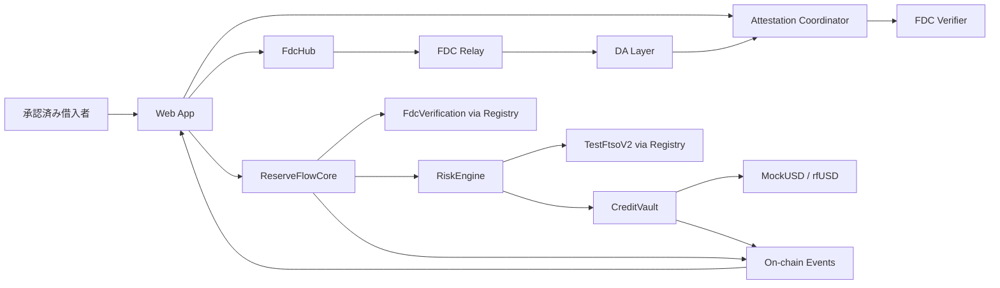
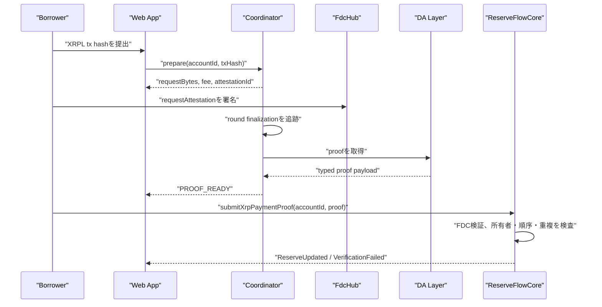
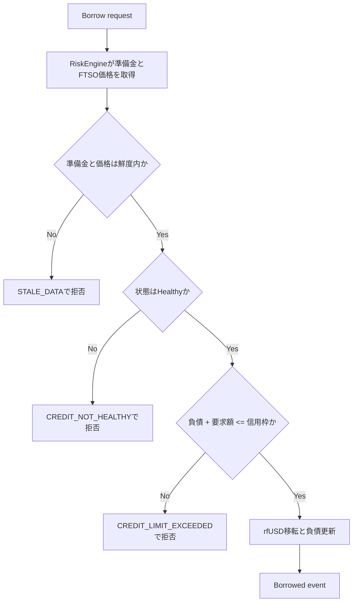
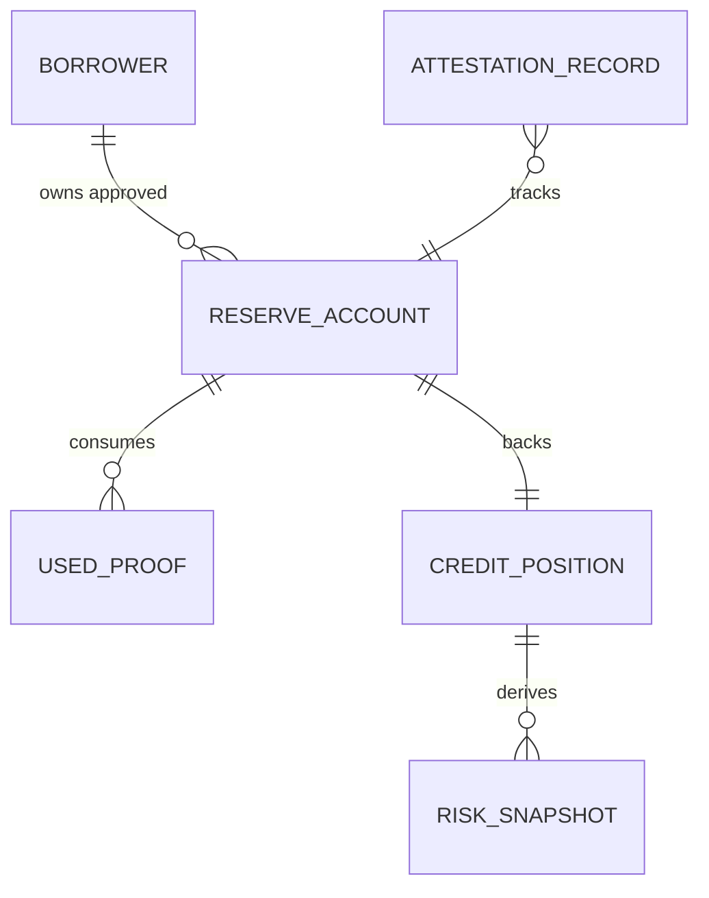

# Technical Design: ReserveFlow Credit

## Overview

ReserveFlow Creditは、XRPL Testnet上のXRP準備金の入出金をFDCで検証し、FTSOのXRP/USD価格を用いてCoston2上のテスト用信用枠へ変換するMVPである。準備金、負債、与信判定の正本はスマートコントラクトに置き、FDCの待機・証明取得の進行状態だけをオフチェーンで管理する。

対象利用者は、事前承認された単一のDAOまたは企業ウォレットである。外部資産の完全な残高を継続的に担保化するものではなく、検証済みかつ鮮度内のイベントに基づくInstitutional Credit Lineとして設計する。

### Goals

- XRPL Testnet XRPの入出金を、検証済み準備金台帳へ安全に反映する。
- 最新かつ鮮度内の価格・準備金データから、説明可能な信用枠を導出する。
- 健全性・鮮度・停止状態を借入の強制ゲートにし、返済を常に可能にする。
- 申請から証明確定までのFDC非同期体験を、再開可能で可視化された状態機械として提供する。

### Non-Goals

- Mainnet、実資産・法定通貨融資、KYC、複数資産／複数外部チェーン。
- 現在残高の包括的な証明、permissionlessな外部アドレス所有権の証明、強制清算。
- 変動金利、信用履歴スコア、分散型清算市場、プロダクション用マルチシグ運用。

## Boundary Commitments

### This Spec Owns

- XRPL Testnet XRP向けの準備金アカウント登録、FDC証明の受理、再利用防止、台帳更新。
- FTSO価格・証明鮮度・リスク係数から導出する信用枠、健全性、借入可否。
- テスト用rfUSDの借入・返済、リスク表示、FDC進行表示、オンチェーン履歴の提示。
- web、attestation worker、contracts、shared SDKの公開境界。

### Out of Boundary

- 外部チェーンの完全な残高・所有権を自動証明する仕組み。
- 外部資産の差し押さえ、清算、実資産の発行／送金、法務・コンプライアンス。
- FDC verifier、DA Layer、FTSO、XRPLネットワークの運用。

### Allowed Dependencies

- Coston2（chain ID 114）、Flare Contract Registry、FDC、FTSO、XRPL Testnet。
- Foundry、OpenZeppelin Contracts、TypeScript、Next.js、viem/wagmi、TanStack Query、および`@flarenetwork`公式periphery package。
- worker用のMVP限定SQLiteストア。これは証明進行のキャッシュであり、金融状態の正本ではない。

### Revalidation Triggers

- FDCの`IXRPPayment`スキーマ、Verifier API、DA Layer API、またはContract Registryの契約形状が変わる。
- FTSO feed ID、テストインターフェース、単位、価格取得の料金モデルが変わる。
- 外部資産、外部チェーン、清算、またはpermissionlessなアカウント登録を追加する。
- リスクパラメータの権限者・既定値・借入許可状態を変更する。

## Architecture

### Existing Architecture Analysis

既存コードはない。リポジトリにはpnpm／Biome設定、調査メモ、UIモックのみがあり、実装の依存方向や契約境界はこの設計で新設する。Steeringに従い、外部証明、リスク計算、コントラクト呼び出し、UIを分離する。

### Architecture Pattern & Boundary Map

**Selected pattern:** ドメイン分割されたオンチェーンCore + Risk + Vaultと、非権威的なオフチェーンAttestation Coordinatorによるhexagonal boundary。外部から渡される証明・価格・RPC値はすべて型付き境界で扱い、与信を変更する前にオンチェーンで検証する。



- `Attestation Coordinator`は証明の準備・追跡・取得のみを担い、与信状態を変更できない。
- `ReserveFlowCore`は検証済み準備金の唯一の書込先、`RiskEngine`は計算の唯一の定義元、`CreditVault`は負債と借入／返済の唯一の書込先とする。
- Contract RegistryからFDC・FTSOのアドレスを解決し、固定アドレスをアプリケーション設定へ置かない。これは[Flareの公式Registryガイド](https://dev.flare.network/network/guides/flare-contracts-registry)に沿う。

### Technology Stack & Alignment

| Layer | Choice / Version | Role in Feature | Notes |
|---|---|---|---|
| Web | Next.js + React + TypeScript | Wallet接続、状態表示、取引起動 | 実装時に厳格なTS設定を追加 |
| Chain client | viem / wagmi | 型付きコントラクト読取・書込 | `any`と未型付ABIを禁止 |
| Contracts | Solidity + Foundry + OpenZeppelin | 台帳、リスク、負債、rfUSD | Coston2向けperiphery import、Cancun EVM |
| Flare data | FDC + TestFtsoV2 | XRPL証明とXRP/USD価格 | Registryで動的解決 |
| Worker | Node.js + TypeScript | FDC状態遷移とDA Layer取得 | 秘密鍵・与信権限を持たない |
| State cache | SQLite | `AttestationRecord`の再開可能な保存 | 正本はオンチェーン |
| Tooling | pnpm workspace + Biome | monoreポ管理・静的品質 | 既存のroot設定を維持 |

## File Structure Plan

### Directory Structure

```text
apps/
├── web/                         # 利用者向けNext.jsアプリ
│   ├── app/                     # 画面とルートハンドラ
│   ├── features/credit/         # Dashboard、Borrow、Repay、Risk UI
│   └── features/attestation/    # 証明フォームと状態タイムライン
└── attestation-worker/          # FDCの準備・追跡・証明取得
    └── src/
packages/
├── contracts/
│   ├── src/                     # ReserveFlowCore、RiskEngine、CreditVault、MockUSD
│   ├── test/                    # unit / integration / invariant tests
│   └── script/                  # deploy、設定、デモ準備
├── sdk/src/                     # ABI、型付きクライアント、単位変換、DTO
└── shared/src/                  # API DTO、エラー、状態遷移の共有型
```

### Modified Files

- `package.json` — ワークスペース共通の検査スクリプトを維持し、各workspaceを委譲する。
- `pnpm-workspace.yaml` — `apps/*`と`packages/*`を登録する。
- `biome.json` — TypeScriptのimport・formatルールをworkspaceへ適用する。

## System Flows

### FDC証明から準備金反映まで



FDCのラウンドは通常90〜180秒で確定するため、同期HTTPリクエストとして待機しない。Coordinatorは再試行可能な進行レコードを更新するだけで、証明の採否は必ず`ReserveFlowCore`が決める。[公式FDCフロー](https://dev.flare.network/fdc/getting-started)に従い、DA Layerのレスポンスはコントラクト検証前に信頼しない。

### 借入とリスク・ゲート



返済はこのゲートを通らない。データが古い、警告、危険、または借入停止中でも、正しいrfUSDを用いた返済は受け付ける。

## Requirements Traceability

| Requirement | Summary | Components | Interfaces | Flows |
|---|---|---|---|---|
| 1.1–1.3 | MVP対象とポジション識別 | Web, ReserveFlowCore, CreditVault | `SupportedReserveConfig`, `CreditPosition` | 登録、借入 |
| 2.1–2.4 | 準備金アカウント登録と所有境界 | Web, ReserveFlowCore, Risk Admin | `RegisterReserveAccount`, `approveReserveAccount` | 登録 |
| 3.1–3.5 | 証明申請・状態・検証失敗 | Coordinator, Web, ReserveFlowCore | `AttestationRecord`, `submitXrpPaymentProof` | FDC証明 |
| 4.1–4.5 | 検証済み準備金台帳とreplay防止 | ReserveFlowCore, SDK | `ReserveAccount`, `ReserveUpdated` | FDC証明 |
| 5.1–5.4 | FTSO評価と鮮度 | RiskEngine, Web | `PriceQuote`, `RiskSnapshot` | 借入、表示 |
| 6.1–6.5 | 与信・健全性・説明 | RiskEngine, Web, CreditVault | `RiskConfig`, `RiskSnapshot` | 借入とリスク |
| 7.1–7.5 | 借入・拒否理由 | CreditVault, MockUSD, Web | `borrow`, `BorrowError` | 借入とリスク |
| 8.1–8.4 | 返済 | CreditVault, MockUSD, Web | `repay`, `RepayError` | 返済 |
| 9.1–9.5 | リスク監視・緊急停止 | RiskEngine, CreditVault, Web | `syncRisk`, `BorrowGate` | 借入とリスク |
| 10.1–10.5 | ダッシュボード、シミュレーション、履歴 | Web, SDK, contract events | `DashboardView`, `ActivityEvent` | 表示 |
| 11.1–11.3 | テスト環境の安全境界 | Web, MockUSD, config | `MvpDisclosure` | 借入画面 |

## Components & Interface Contracts

| Component | Domain/Layer | Intent | Req Coverage | Key Dependencies | Contracts |
|---|---|---|---|---|---|
| ReserveFlowCore | On-chain reserve | 検証済み準備金の登録・台帳・replay防止 | 1, 2, 3, 4 | FdcVerification (P0) | Service, Event |
| RiskEngine | On-chain risk | 価格・鮮度・Haircut・LTV・状態の導出 | 5, 6, 9 | TestFtsoV2, Core (P0) | Service, State |
| CreditVault | On-chain credit | 負債、借入、返済、借入停止 | 1, 6, 7, 8, 9 | RiskEngine, MockUSD (P0) | Service, Event, State |
| MockUSD | On-chain token | デモ用rfUSDの保有・移転 | 7, 8, 11 | CreditVault (P0) | Service |
| Attestation Coordinator | Worker | FDCの状態遷移、DA取得、再開 | 3, 10 | Verifier, DA Layer (P0) | API, Batch, State |
| Web App | Presentation | 取引起動、進行状態、説明可能な表示 | 1–11 | SDK, wallet, Coordinator (P0) | API, State |
| SDK / Shared | Boundary | 単位・DTO・ABI・エラーを統一 | 3–10 | contracts, worker, web (P0) | Service, State |

### On-chain Reserve Domain

#### ReserveFlowCore

| Field | Detail |
|---|---|
| Intent | 検証済みXRPL Paymentだけを準備金台帳へ反映する。 |
| Requirements | 1.1–1.3, 2.1–2.4, 3.3–3.5, 4.1–4.5 |

**Responsibilities & Constraints**

- `accountId = keccak256(borrower, sourceId, externalAddressHash)`でアカウントを一意にする。
- MVPではRisk Adminが借入者と外部アドレスの組み合わせを承認してから有効化する。これはXRPL所有権のpermissionless証明を提供しないことを明示した、Institutional Credit Lineの境界である。
- `verifyXRPPayment`が成功し、`proofOwner == msg.sender`、成功ステータス、対象アドレス、単調増加する外部ledger index、未使用のproof IDを満たす場合だけ更新する。
- 受信は残高を増加、送信は残高を減少させる。出金額にはネットワーク手数料を含み得るため、保守的に減少として扱う。

**Dependencies**

- Inbound: Web / 借入者 — 登録・証明提出（Critical）
- Outbound: FdcVerification — Merkle証明の検証（Critical）
- Outbound: RiskEngine — 検証済み準備金の読取（Critical）

**Contracts**: Service [x] / API [ ] / Event [x] / Batch [ ] / State [x]

##### Service Interface

```typescript
type AccountId = `0x${string}`;
type ProofId = `0x${string}`;
type Drops = bigint;

interface ReserveFlowCoreClient {
  registerReserveAccount(input: RegisterReserveAccount): Promise<AccountId>;
  submitXrpPaymentProof(input: SubmitXrpPaymentProof): Promise<TransactionHash>;
  getReserveAccount(accountId: AccountId): Promise<ReserveAccount>;
}

interface ReserveAccount {
  readonly id: AccountId;
  readonly borrower: Address;
  readonly sourceId: "testXRP";
  readonly externalAddressHash: `0x${string}`;
  readonly balanceDrops: Drops;
  readonly lastExternalLedger: bigint;
  readonly lastAttestedAt: bigint;
  readonly status: "PENDING_APPROVAL" | "ACTIVE" | "STALE" | "FROZEN";
}
```

- Preconditions: 登録者は承認済み借入者、証明は登録済みかつ有効な`accountId`を対象とする。
- Postconditions: 成功した証明は一度だけ台帳を更新し、`ReserveUpdated`を発行する。
- Invariants: 未検証証明、失敗証明、異なる借入者の証明は残高に影響しない。

##### Event Contract

- Published: `ReserveAccountRegistered`, `ReserveAccountApproved`, `ReserveUpdated`, `ReserveAccountFrozen`, `ProofRejected`。
- Ordering: 同一`accountId`の`ReserveUpdated`は外部ledger indexを単調増加させる。
- Consumers: WebのActivity projection、CreditVault／RiskEngineの読取、監査ログ。

### On-chain Risk and Credit Domain

#### RiskEngine

| Field | Detail |
|---|---|
| Intent | 準備金、FTSO価格、鮮度、リスク設定から単一のリスクスナップショットを導出する。 |
| Requirements | 5.1–5.4, 6.1–6.5, 9.1–9.4 |

**Responsibilities & Constraints**

- Coston2ではContract Registryから`TestFtsoV2`を解決し、XRP/USDの`getFeedByIdInWei`を使う。`getFeedByIdInWei`は18桁精度の値とタイムスタンプを返す。[公式インターフェース](https://dev.flare.network/ftso/solidity-reference/FtsoV2Interface)に従う。
- `grossUsdWad = balanceDrops * priceWad / 1_000_000`、`adjustedUsdWad = grossUsdWad * (BPS - haircutBps) / BPS`、`creditLimitWad = adjustedUsdWad * advanceRateBps / BPS`とする。
- 価格TTLまたは準備金TTLを超えた場合、価格・残高を表示できても、借入可のスナップショットを返してはならない。
- 負債が0の場合のhealth factorは無限大を意味する専用状態とし、数値の最大値へ意味を混在させない。

##### MVP Risk Policy

| Parameter | Initial value | Effect |
|---|---:|---|
| `haircutBps` | 3,000 (30%) | 総準備金評価額を70%へ減額する |
| `advanceRateBps` | 5,000 (50%) | リスク調整後価値の50%を信用枠とする |
| `priceTtlSeconds` | 60 | 超過時は`PRICE_STALE`となり借入停止 |
| `reserveTtlSeconds` | 900 (15分) | 超過時は`RESERVE_STALE`となり借入停止 |
| `warningHealthBps` | 12,000 (120%) | 100%以上120%未満は`WARNING` |
| `marginCallHealthBps` | 10,000 (100%) | 100%未満は`MARGIN_CALL` |

- `HEALTHY`はhealth factorが120%以上で、価格・準備金が鮮度内、アカウントが凍結されておらず、借入停止が解除されている場合にのみ返す。
- `WARNING`、`MARGIN_CALL`、`PRICE_STALE`、`RESERVE_STALE`、`FROZEN`は新規借入を拒否する。返済は全状態で許可する。
- すべての`mulDiv`計算とhealth factorは切り捨てる。これにより、丸めが借入可能額を増加させない。設定値の更新は`RISK_ADMIN`だけが実行し、`RiskConfigUpdated`に新旧のconfig versionを記録する。

**Dependencies**

- Inbound: CreditVault / 借入時の必須照会（Critical）
- Outbound: ReserveFlowCore / 準備金読取（Critical）
- External: TestFtsoV2 / 価格読取（Critical）

**Contracts**: Service [x] / API [ ] / Event [x] / Batch [ ] / State [ ]

##### Service Interface

```typescript
type Wad = bigint;
type BasisPoints = bigint;

interface RiskEngineClient {
  getRiskSnapshot(input: { accountId: AccountId; debtWad: Wad }): Promise<RiskSnapshot>;
  simulatePriceDrop(input: { accountId: AccountId; debtWad: Wad; dropBps: BasisPoints }): Promise<RiskSnapshot>;
}

interface RiskSnapshot {
  readonly grossReserveUsdWad: Wad;
  readonly adjustedReserveUsdWad: Wad;
  readonly creditLimitWad: Wad;
  readonly availableCreditWad: Wad;
  readonly healthFactorBps: BasisPoints | "INFINITE";
  readonly priceTimestamp: bigint;
  readonly reserveTimestamp: bigint;
  readonly status: "HEALTHY" | "WARNING" | "MARGIN_CALL" | "PRICE_STALE" | "RESERVE_STALE" | "FROZEN";
}
```

- Preconditions: `accountId`がACTIVEまたは明示的にFROZENな既存アカウント。
- Postconditions: 同一ブロック状態・同一リスク設定では同一スナップショットを返す。
- Invariants: すべての金額は固定小数点整数であり、丸めは常に借入者に有利にならない方向へ行う。

#### CreditVault and MockUSD

| Field | Detail |
|---|---|
| Intent | ポジション負債を保持し、リスクゲートを通過した借入と、常時許可される返済を実行する。 |
| Requirements | 1.3, 6.2–6.5, 7.1–7.5, 8.1–8.4, 9.2–9.5, 11.1–11.3 |

**Responsibilities & Constraints**

- `CreditVault`は借入の直前に最新の`RiskSnapshot`を取得し、`HEALTHY`、鮮度内、未停止、要求後負債が信用枠以下の場合だけrfUSDを移転する。
- `repay`は停止状態を確認せず、Vaultに対するrfUSD allowanceが返済額以上である場合にだけ`transferFrom`を実行し、負債を減額する。
- `MockUSD`はCoston2デモ専用である。デプロイ時に`1,000,000 rfUSD`をVaultへ一度だけ供給し、その直後に`MINTER_ROLE`を撤回する。Vaultはmintせず、保有残高から`transfer`する。
- `RISK_ADMIN`のみが新規借入の緊急停止、アカウント凍結、リスク設定の変更を実行でき、必ずイベントを出す。

##### rfUSD Repayment Flow

1. Webは借入者のrfUSD残高と`allowance(borrower, CreditVault)`を読み取る。
2. allowanceが返済額未満のとき、Webは先に`approve(CreditVault, repaymentAmount)`を署名・確定させる。
3. approval確定後、Webは`repay(repaymentAmount)`を送信する。Vaultは`transferFrom`成功後にのみprincipalを減額する。
4. allowance不足、残高不足、またはtoken transfer失敗時は、`INSUFFICIENT_RFUSD_ALLOWANCE`、`INSUFFICIENT_RFUSD_BALANCE`、`RFUSD_TRANSFER_FAILED`を表示し、principalを変更しない。

**Contracts**: Service [x] / API [ ] / Event [x] / Batch [ ] / State [x]

##### Service Interface

```typescript
interface CreditVaultClient {
  openCreditLine(accountId: AccountId): Promise<TransactionHash>;
  borrow(amountWad: Wad): Promise<TransactionHash>;
  repay(amountWad: Wad): Promise<TransactionHash>;
  syncRisk(): Promise<TransactionHash>;
  getPosition(borrower: Address): Promise<CreditPosition>;
}

interface CreditPosition {
  readonly borrower: Address;
  readonly reserveAccountId: AccountId;
  readonly principalWad: Wad;
  readonly status: RiskSnapshot["status"];
  readonly openedAt: bigint;
  readonly lastRiskSyncAt: bigint;
}

type BorrowError = "CREDIT_NOT_HEALTHY" | "CREDIT_LIMIT_EXCEEDED" | "STALE_PRICE" | "STALE_RESERVE" | "BORROWING_PAUSED";
type RepayError = "ZERO_AMOUNT" | "EXCESS_REPAYMENT" | "INSUFFICIENT_RFUSD_ALLOWANCE" | "INSUFFICIENT_RFUSD_BALANCE" | "RFUSD_TRANSFER_FAILED";

interface MockUsdClient {
  allowance(input: { owner: Address; spender: Address }): Promise<Wad>;
  balanceOf(owner: Address): Promise<Wad>;
  approve(input: { spender: Address; amountWad: Wad }): Promise<TransactionHash>;
}
```

- Preconditions: `borrow`にはアクティブなポジション、正の額、現在時点で有効なリスクスナップショットが必要。
- Postconditions: `Borrowed`または`Repaid`イベントは新しいprincipalと使用したcredit limitを含む。
- Invariants: principalは負にならず、借入失敗時にトークン残高・principal・リスク状態を部分更新しない。

### Off-chain Attestation Domain

#### Attestation Coordinator

| Field | Detail |
|---|---|
| Intent | FDCの遅延を利用者に隠さず、準備・追跡・取得を再開可能にする。 |
| Requirements | 3.1–3.5, 10.4–10.5 |

**Responsibilities & Constraints**

- Verifierへ型付き入力でリクエストを準備し、`abiEncodedRequest`、request hash、提出トランザクション、round IDを記録する。
- `proofOwner`はクライアント入力から受け取らず、登録済み`ReserveAccount.borrower`から決定する。prepared requestは、その借入者と`testXRP`だけに束縛する。
- Coordinatorは、準備済みの同一request bytesに対するFDC request feeをFlare Contract Registry経由のFDC fee configurationから取得し、C2FLRのwei値として返す。
- Relayの確定後にDA LayerからレスポンスとMerkle proofを取得する。コンテンツを事業ロジックとして解釈・承認しない。
- Webへ`PROOF_READY`を返すが、契約への最終提出は借入者ウォレットが行う。workerは秘密鍵、FDC手数料支払権限、借入権限を持たない。
- SQLiteの失敗・再起動時は、request hashとround IDから追跡を再開できる。

**Contracts**: Service [ ] / API [x] / Event [ ] / Batch [x] / State [x]

##### API Contract

| Method | Endpoint | Request | Response | Errors |
|---|---|---|---|---|
| POST | `/attestations/prepare` | `accountId`, `txHash` | `AttestationPrepared` | `400 INVALID_INPUT`, `409 ACTIVE_REQUEST`, `502 FDC_FEE_UNAVAILABLE` |
| POST | `/attestations/{id}/submitted` | `requestTxHash` | `AttestationRecord` | `400 REQUEST_TX_MISMATCH`, `402 INSUFFICIENT_C2FLR_FEE` |
| GET | `/attestations/{id}` | — | `AttestationRecord` | `404 NOT_FOUND` |
| POST | `/attestations/{id}/refresh` | — | `AttestationRecord` | `409 NOT_FINALIZED`, `502 DA_UNAVAILABLE` |

```typescript
interface AttestationPrepared {
  readonly id: string;
  readonly requestBytes: `0x${string}`;
  readonly requestBytesHash: `0x${string}`;
  readonly sourceId: "testXRP";
  readonly proofOwner: Address;
  readonly requiredFeeWei: bigint;
  readonly expiresAt: string;
}
```

WebはCoston2（chain ID 114）とC2FLR残高を確認後、返却された`requestBytes`を変更せず、`requiredFeeWei`ちょうどを添えて`FdcHub.requestAttestation`へ送信する。`submitted`はreceiptを検証してround IDを自ら算出するため、クライアントはround IDを指定できない。

##### State Management

```typescript
type AttestationStatus =
  | "PREPARING"
  | "READY_TO_SUBMIT"
  | "SUBMITTED"
  | "WAITING_FINALIZATION"
  | "FETCHING_PROOF"
  | "PROOF_READY"
  | "VERIFIED"
  | "FAILED"
  | "EXPIRED";

interface AttestationRecord {
  readonly id: string;
  readonly accountId: AccountId;
  readonly txHash: `0x${string}`;
  readonly requestBytesHash: `0x${string}`;
  readonly votingRoundId?: bigint;
  readonly status: AttestationStatus;
  readonly failure?: AttestationFailure;
  readonly createdAt: string;
  readonly updatedAt: string;
}
```

- Concurrency: `requestBytesHash`を一意キーとし、同じ依頼の複数refreshは同一recordを返す。
- Recovery: `WAITING_FINALIZATION`以降はpollを再実行できる。`VERIFIED`はCoreのイベント確認後のみ設定する。

### Presentation and Shared Boundary

#### Web App and SDK

| Field | Detail |
|---|---|
| Intent | 型付きの取引境界と、根拠を確認できる信用体験を提供する。 |
| Requirements | 1–11 |

**Responsibilities & Constraints**

- SDKはABI、アドレス、DTO、単位変換、契約エラーのマッピングを一元化し、画面が計算式や生のproof構造を複製しないようにする。
- UIは準備金評価、Haircut、LTV、信用枠、負債、利用可能額、health、データ鮮度、借入可否、拒否理由を同じ`RiskSnapshot`から表示する。
- 価格下落シミュレーションはオンチェーン状態を変更せず、現在の残高・負債と入力BPSを`simulatePriceDrop`へ渡して表示専用の結果を返す。
- すべての金額を`bigint`で保持し、表示用の文字列への変換は最終ビューだけで行う。

##### State Management

```typescript
interface DashboardView {
  readonly position: CreditPosition;
  readonly risk: RiskSnapshot;
  readonly reserve: ReserveAccount;
  readonly attestation?: AttestationRecord;
  readonly activity: readonly ActivityEvent[];
  readonly borrowingEnabled: boolean;
  readonly blockingReasons: readonly BorrowError[];
}

interface ActivityEvent {
  readonly kind: "RESERVE_REGISTERED" | "PROOF_SUBMITTED" | "PROOF_VERIFIED" | "PROOF_REJECTED" | "RESERVE_UPDATED" | "BORROWED" | "REPAID" | "RISK_CHANGED" | "BORROWING_PAUSED";
  readonly occurredAt: bigint;
  readonly transactionHash?: TransactionHash;
  readonly details: Readonly<Record<string, string>>;
}
```

## Data Models

### Domain Model



- **ReserveAccount**: 外部アドレス、検証済みdrops残高、最後の証明時刻／ledger、アクティブ状態を持つオンチェーン集約。
- **CreditPosition**: 借入者ごとに1つ。負債はWADで保持し、準備金アカウントを参照する。
- **UsedProof**: proof IDを一度だけ消費する不変レコード。残高を二重更新させない。
- **RiskSnapshot**: 保存された担保価値ではなく、Core・FTSO・RiskConfigから導出する読み取りモデル。
- **AttestationRecord**: 非権威的なworkerレコード。FDC状態を再開するためだけに存在する。

### Logical Data Model

| Entity | Natural key | Authoritative fields | Integrity rules |
|---|---|---|---|
| ReserveAccount | `accountId` | borrower, externalAddressHash, balanceDrops, lastAttestedAt | borrower/source/addressの組合せで一意、外部ledgerは単調増加 |
| UsedProof | `proofId` | accountId, consumedAt | 一度だけ消費可 |
| CreditPosition | borrower address | reserveAccountId, principalWad, status | 1 borrower : 1 position、principalは0以上 |
| RiskConfig | config version | haircutBps, advanceRateBps, TTLs, thresholds | 0–10,000 BPS、変更をイベント化 |
| AttestationRecord | requestBytesHash | status, roundId, failure | 同一requestの二重進行禁止 |

### Data Contracts & Integration

- **FDC入力**: `txHash`、登録済みborrowerから導出する`proofOwner`、`sourceId: testXRP`を型付きにし、Verifierが生成するrequest bytesはopaque binaryとして保存する。feeは同一request bytesに対して取得した`requiredFeeWei`のみを使用する。
- **FDC出力**: DA Layerから取得したproofは`IXRPPayment.Proof`にデコードし、Coreが`verifyXRPPayment`を実行するまで信用しない。
- **価格出力**: `priceWad: bigint`と`timestamp: bigint`でSDKへ渡す。フロントエンドはraw decimalまたはJS numberへ変換しない。
- **イベント互換性**: 公開イベントは`accountId`、borrower、proofId、delta、principal、timestampを含め、イベント種別を変更する場合は新規eventを追加する。

## Error Handling

### Error Strategy

境界ごとに、入力検証・外部依存失敗・業務ルール違反を分離する。画面は契約revertやworkerエラーを安定した機械可読コードへ写像し、利用者に取るべき行動を表示する。部分成功は認めず、契約書込は原子的に失敗する。

### Error Categories and Responses

| Category | Code examples | Response | Recovery |
|---|---|---|---|
| Input | `INVALID_XRPL_ADDRESS`, `INVALID_AMOUNT` | 該当フィールドを強調 | 修正して再送 |
| FDC | `NOT_FINALIZED`, `DA_UNAVAILABLE`, `INVALID_FDC_PROOF` | 進行状態と安全な失敗理由を表示 | refresh／再申請 |
| FDC funding | `FDC_FEE_UNAVAILABLE`, `INSUFFICIENT_C2FLR_FEE` | 必要なC2FLR額またはfee取得失敗を表示 | C2FLRを補充して再試行 |
| Proof business rule | `PROOF_ALREADY_USED`, `PROOF_OWNER_MISMATCH`, `OUT_OF_ORDER_LEDGER` | 準備金は変更しない | 新しい正しい証明を提出 |
| Risk | `STALE_PRICE`, `STALE_RESERVE`, `CREDIT_NOT_HEALTHY` | 借入停止理由と必要な更新／返済を表示 | 証明更新、価格回復、返済 |
| Credit | `CREDIT_LIMIT_EXCEEDED`, `EXCESS_REPAYMENT` | 許可可能な額を表示 | 金額を変更 |
| Operational | `BORROWING_PAUSED`, `ACCOUNT_FROZEN` | 影響範囲と返済可否を表示 | Risk Admin解除または返済 |

### Monitoring

- Worker: 状態別件数、FDC round待機時間、DA取得失敗数、`EXPIRED`件数を構造化ログ化する。
- Contracts: `ProofRejected`、`ReserveUpdated`、`Borrowed`、`Repaid`、`RiskConfigUpdated`、`BorrowingPaused`をイベントから監視する。
- UI: stale状態、risk状態、最終同期時刻をポーリングし、偽の「リアルタイム」表示をしない。

## Testing Strategy

### Unit Tests

- ReserveFlowCore: 有効な入金・出金、失敗Payment、無関係アドレス、重複proof、順序逆転ledger、残高超過出金を検証する。
- RiskEngine: drops→WAD換算、Haircut、LTV、TTL境界、負債ゼロ、100%・120%などの状態閾値を検証する。
- CreditVault: 枠内借入、枠超過、stale状態、停止状態、allowance不足、残高不足、返済後のprincipal／available creditを検証する。
- Shared SDK: `bigint`単位変換、イベント→ActivityEvent変換、revert codeのdiscriminated unionを検証する。

### Integration Tests

- FDCのfixture proofを用い、`submitXrpPaymentProof`から`ReserveUpdated`、`getRiskSnapshot`、`borrow`までを検証する。
- 出金proof後に信用枠とhealthが低下し、新規借入が停止することを検証する。
- workerの`SUBMITTED → WAITING_FINALIZATION → PROOF_READY → VERIFIED`、receiptからのround ID算出、fee不一致の拒否、および再起動後の再開を検証する。
- Registry経由のFDC／FTSO解決が固定アドレスへ依存しないことを検証する。

### E2E/UI Tests

- 準備金アカウント登録から証明待機・完了・台帳反映までを表示する。
- 有効なデータで借入プレビューと借入成功を表示する。
- stale price、stale reserve、margin call、emergency pauseでの借入拒否理由を表示する。
- allowance不足時にrfUSD approvalを案内し、approval後の返済が停止状態でも可能で、ダッシュボード・Activityが更新されることを確認する。

### Security Tests

- proofOwner不一致、replay、別のaccount ID、異なるsource ID、失敗XRPL Payment、改ざんproofを拒否する。
- 管理者以外が設定変更、アカウント承認、凍結、借入停止を実行できないこと、借入可能額が丸めで増加しないことを検証する。
- fuzz / invariantとして、principalが負にならない、used proofが残高を二度更新しない、stale入力が借入を成功させないことを確認する。

## Security Considerations

- **FDC／DA Layer**: proofはオフチェーンで取得されても、`FdcVerification`による検証後だけに利用する。proofの原文をLLMや非型付パーサへ渡さない。
- **準備金の限界**: 単一送金証明は完全残高を保証しない。MVPは承認制アドレス、短TTL、保守的な設定、明示的なリスク表示に限定する。
- **Authorization**: 借入者、`proofOwner`、承認済みアカウントを一致させる。Risk Adminの権限は最小にし、すべてイベント化する。
- **Unit safety**: `drops`、WAD、BPSを別型として扱う。加減乗除の丸めは借入上限を過大評価しない。
- **Funds**: rfUSDはCoston2限定のテストトークンであり、画面・契約メタデータ・READMEで本番融資でないことを明示する。

## Supporting References

- 詳細な調査根拠、選択肢、未解決事項は[research.md](research.md)を参照する。
- FDC integration patterns: [Flare FDC Getting Started](https://dev.flare.network/fdc/getting-started)
- XRPL proof contract: [IXRPPayment Reference](https://dev.flare.network/fdc/reference/IXRPPayment)
- Coston2 price feed: [FTSO Feed Reference](https://dev.flare.network/ftso/solidity-reference/FtsoV2Interface)
