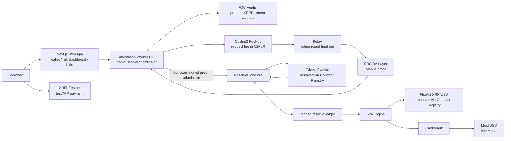

# ReserveFlow Credit

> **XRPLの支払いイベントを、Flareで検証可能なテスト用信用枠へ変換する。**

**Flare Summer Signal — Interoperable Asset Products** 向けのCoston2 MVPです。XRPL TestnetのXRP入出金をFlare Data Connector（FDC）で検証し、freshなFTSO XRP/USD価格と組み合わせて、テスト用rfUSDの保守的な信用枠を導出します。

| リンク | 状態 |
| --- | --- |
| ソースコード | [GitHub](https://github.com/mashharuki/Flare-Summer-Signal-Hackathon-2026) |
| Live demo | Vercel公開準備中。手順は[フロントエンド配信](#フロントエンド配信)を参照 |
| ネットワーク | Coston2（chain ID `114`）とXRPL Testnet |
| 対象トラック | Interoperable Asset Products |

> **デモの安全境界**: Coston2、XRPL Testnet、`testXRP`、テスト用rfUSDのみを扱います。本番融資・実資産・法定通貨・mainnetではありません。秘密鍵、XRPL seed、Verifier APIキーをコミット・ログ・チャットに残しません。

## 概要

XRP保有者が流動性を得るために資産を売却する場合、価格上昇へのエクスポージャーを失い、外部チェーン上の資産状況をEVMの信用ロジックへ安全に持ち込む仕組みも必要になります。ReserveFlow Creditは、この「外部で起きた支払い」と「オンチェーンで実行する与信判断」の間を、FlareのデータプロトコルでつなぐMVPです。

ユーザーはXRPL Testnetの支払いを指定し、FDCの`XRPPayment` attestationを申請します。Coston2の`ReserveFlowCore`がproofをオンチェーン検証した後だけ、`RiskEngine`がFTSOのXRP/USD価格と証明済み台帳を使って信用枠を計算します。`CreditVault`は、その結果が`HEALTHY`である時だけテスト用rfUSDの借入を許可します。

## 解決した課題

| 課題 | 従来の問題 | ReserveFlowの回答 |
| --- | --- | --- |
| XRPの流動性 | 売却すると保有し続ける選択肢を失う | 検証済みの`testXRP`入出金イベントを、テスト用信用枠の入力にする |
| 外部チェーンの信頼 | アプリ運営者や単一RPCの申告では、スマートコントラクトが検証できない | FDC `XRPPayment`のMerkle proofを`FdcVerification`で検証してから台帳を更新する |
| 価格・準備金の鮮度 | 古い価格や古い準備金で借入を許すとリスクが読めない | FTSO価格は60秒、準備金proofは900秒のTTLで判定し、staleなら新規借入を止める |
| 非同期な証明体験 | proof待機中に「失敗したのか待機中なのか」が分からない | request → FDC round待機 → proof取得 → Core検証の進行状況、再開方法、失敗理由を明示する |

## このプロダクトにおける具体的なアプローチ

### Flareが不可欠な理由

ReserveFlowの価値は、FDCとFTSOのどちらか一方だけでは成立しません。

1. **FDC**がXRPL Testnetの特定支払いを検証可能なproofに変換します。Workerの取得結果を信頼せず、`ReserveFlowCore`がCoston2 Contract Registryから解決した`FdcVerification`で検証します。
2. **FTSO**がXRP/USD価格とタイムスタンプを提供します。`RiskEngine`は固定アドレスを使わず、Contract Registryから`FtsoV2`を解決します。
3. **与信ロジック**は、検証済み台帳・freshな価格・30% haircut・50% advance rate・停止状態を同時に評価し、`HEALTHY`な時だけ借入を通します。

つまり、FDCがなければ外部XRPLイベントを信用枠へ安全に反映できず、FTSOがなければそのXRPを保守的なUSD建て枠へ変換できません。これがInteroperable Asset ProductsにおけるFlare統合の中核です。

### 2分で見せるデモフロー

1. Coston2に接続し、XRPL Testnetのアドレスと`tesSUCCESS`支払いを入力する。
2. FDC requestを送り、投票ラウンドの確定とDA Layerからのproof取得を表示する。
3. 借入者がproofを`ReserveFlowCore`へ提出する。CoreがFDC verificationを通過した時だけ準備金台帳が更新される。
4. FTSO価格・証明鮮度・信用枠・healthを同一スナップショットで確認し、`HEALTHY`の場合だけテスト用rfUSDを借りる。
5. stale data、重複proof、順序逆転、緊急停止では借入を拒否し、返済は維持されることを見せる。

## ハッカソンで実装した機能一覧表

| 機能 | 実装内容 | 審査で確認できるポイント |
| --- | --- | --- |
| XRPL→Flare proofフロー | Verifier request、FdcHub fee、voting round、Relay finalization、DA Layer proof、Core提出を`XRPPayment`で接続 | 外部チェーンの支払いがFDC経由でオンチェーン判定へ到達する |
| proofの安全境界 | `proofOwner`、成功支払い、入出金方向、XRPLアドレス、request hashを検査し、Coreで`verifyXRPPayment`を必須化 | Workerが金融状態の権限者ではないことをコードで示す |
| 再開可能なCoordinator | SQLiteに進行状況を保存し、既存requestを再利用して再起動・DA障害・timeoutから復帰 | FDC feeの二重払いを避け、待機をUXとして扱う |
| 準備金台帳 | 承認済み借入者だけが登録でき、replay・順序逆転・過剰出金・無効proofを拒否 | 入出金の正しい反映と不変条件テスト |
| FTSOリスク判定 | XRP/USD、30% haircut、50% advance rate、60秒価格TTL、900秒準備金TTL、`HEALTHY`〜`FROZEN`を計算 | 価格表示ではなく、借入可否を直接制御するFTSO活用 |
| テスト用信用枠 | `CreditVault`はhealth・pause・上限を原子的に検査して借入、全risk stateで返済可能 | リスク時に新規借入を止めても返済不能にしない |
| 借入者向けUI | Coston2 wallet guard、XRPL入力検証、FDCタイムライン、信用枠・freshness・価格下落シミュレーション、活動履歴 | 成功だけでなくstale・誤ネットワーク・margin callの回復導線 |
| 多言語UX | 日本語／英語の切替とローカル保存 | 審査・利用者の双方に意図と安全境界を伝える |
| 再現性 | Foundry unit/fuzz/invariant、Worker fixture、Web E2E fixture、Coston2 read-only smoke、Vercel設定 | ローカルテストとCoston2実行を分離して再現可能にする |

## システム構成図



### 信頼モデル

- WorkerとDA Layerの出力は、`ReserveFlowCore`のFDC検証前には未信頼です。
- FDC `XRPPayment`は**単一支払いイベント**の証明であり、継続的な口座残高・準備金総額・外部アドレスの所有権を包括的に証明するものではありません。
- UIの現在値はデモ用snapshotを中心に表示します。proofが`PROOF_READY`でも、オンチェーン`ReserveFlowCore`提出とイベント確認前は準備金更新として扱いません。

## 技術スタック

| レイヤー | 採用技術 | 役割 |
| --- | --- | --- |
| Flare | Coston2（114）、FDC `XRPPayment`、FDC DA Layer、FTSO v2、Contract Registry | 外部支払いの検証、価格取得、ネットワーク依存コントラクトの安全な解決 |
| 外部チェーン | XRPL Testnet、`testXRP`、`xrpl` | 支払いイベントの発生と形式検証 |
| Smart contract | Solidity `0.8.30`、Foundry、OpenZeppelin | `ReserveFlowCore`、`RiskEngine`、`CreditVault`、テスト用`MockUSD` |
| Coordinator | Node.js、TypeScript、`viem`、`sql.js` | FDC request／待機／proof取得／再開可能な進行管理 |
| Frontend | Next.js 16、React 19、TypeScript | Coston2接続、リスク表示、借入・返済preview、日英UI |
| 品質 | pnpm workspace、Vitest、Foundry fuzz/invariant、Biome | コントラクト、Worker、Webの回帰防止 |
| 配信 | Vercel（frontend設定済み） | `apps/web`のPreview／Productionデプロイ |

## ハッカソン提出との整合性

Flare Summer Signalでは、役に立つ製品、意味のあるFlare統合、動作するデモ、技術的な明確さ、新規の実装内容、継続可能性を示す必要があります。ReserveFlowは次の形でそれに対応します。

| 提出で伝えること | このリポジトリの根拠 |
| --- | --- |
| Product usefulness | XRPを売却せずに流動性判断を行うための、検証可能な信用枠MVP |
| Flare integration quality | FDC proofとFTSO freshnessの両方が借入可否を決め、片方だけでは機能しない |
| Technical execution | Coston2-onlyのコントラクト、FDC実行CLI、Web導線、テスト・smokeを分離 |
| Evidence of new work | XRPL attestation coordinator、リスクエンジン、信用vault、利用者UX、再現可能な検証を実装 |
| Future potential | テスト環境で狭い1資産・1チェーン・1attestationを完成させ、mainnet化の前提を明示 |

## 現在の制約と次のステップ

- **本番融資ではありません。** Coston2、XRPL Testnet、`testXRP`、テスト用rfUSDだけを対象とします。
- FDC proofは残高証明ではなく、検証済みの入出金イベントを台帳へ反映するMVPモデルです。
- Webは現在、デモsnapshotとtransaction previewを中心にしています。ブラウザからの借入・返済・Core提出を完全に結線する前に、セキュリティレビューが必要です。
- Attestation Workerは公開HTTP APIではなく、秘密情報を持つ運用者が実行するCLIです。VercelにはWorker APIキーや秘密鍵を置きません。
- 次段階では、ウォレットによる実トランザクションUX、認証・キューを備えたWorker API、監査、流動性・清算設計、mainnet固有のリスクパラメータを個別に検証します。

## セットアップとデモ実行

詳細な運用手順は[operation guide](docs/operation.md)にあります。ここでは再現の最短経路を示します。

### 1. ローカル準備

```sh
pnpm install
cp .env.example .env
cp apps/web/.env.local.example apps/web/.env.local
```

`.env`にはCoston2 RPC、FDC Verifier APIキー、Workerの永続DBパスだけを設定します。`apps/web/.env.local`にはブラウザに公開してよい`NEXT_PUBLIC_`値だけを置きます。**借入者秘密鍵はWorkerへ設定しません。**

### 2. Webを起動する

```sh
pnpm --filter @reserveflow/web dev
```

`http://localhost:3000`を開きます。Coston2以外のネットワークは拒否されます。

### 3. Coston2 / FDCのread-only確認

```sh
set -a; source .env; set +a
export COSTON2_FDC_SMOKE_CONFIRM='READ_COSTON2_FDC'
pnpm --filter @reserveflow/attestation-worker smoke:coston2-fdc
```

FDC fee支払い・proof提出は、Workerではなく利用者の接続ウォレットが行います。実行前に[operation guide](docs/operation.md)と[XRPL payment proof guide](docs/xrp-payment-proof-request.md)を確認してください。

ハッカソンでの通し実演には、[デモンストレーション手順書](docs/demo-runbook.md)を使用してください。

## フロントエンド配信

VercelではRoot Directoryに`apps/web`を指定します。`apps/web/vercel.json`がmonorepoルートからのinstall/buildを設定します。Preview・Productionへ設定してよいのは次だけです。

```dotenv
NEXT_PUBLIC_COSTON2_RPC_URL=https://coston2-api.flare.network/ext/C/rpc
NEXT_PUBLIC_ATTESTATION_WORKER_URL=https://attestation.example.com
NEXT_PUBLIC_RESERVE_FLOW_CORE_ADDRESS=0x...
NEXT_PUBLIC_FDC_HUB_ADDRESS=0x...
NEXT_PUBLIC_CREDIT_VAULT_ADDRESS=0x...
NEXT_PUBLIC_RFUSD_ADDRESS=0x...
```

`NEXT_PUBLIC_`値はブラウザへ埋め込まれます。`FDC_VERIFIER_API_KEY_TESTNET`、XRPL seed、秘密鍵をVercelへ設定してはいけません。詳細は[operation guide](docs/operation.md)を参照してください。

## テスト

```sh
pnpm test
pnpm typecheck
pnpm check
pnpm --filter @reserveflow/contracts test
pnpm --filter @reserveflow/contracts typecheck
pnpm --filter @reserveflow/attestation-worker test
pnpm --filter @reserveflow/web test
pnpm --filter @reserveflow/web test:e2e:fixtures
pnpm --filter @reserveflow/web build
```

## 提出前チェック

- [ ] VercelのLive URLを上部の表へ追加する
- [ ] Coston2のデプロイ済みコントラクトアドレスとexplorerリンクを追加する
- [ ] 2分以内のデモ動画を追加する
- [ ] FDC request、proof submission、stale/replay拒否の一例を動画またはスクリーンショットで示す
- [ ] このハッカソンで新規に実装・改善した範囲をDevpost / DoraHacks提出文にも明記する

## License

[MIT](LICENSE)
