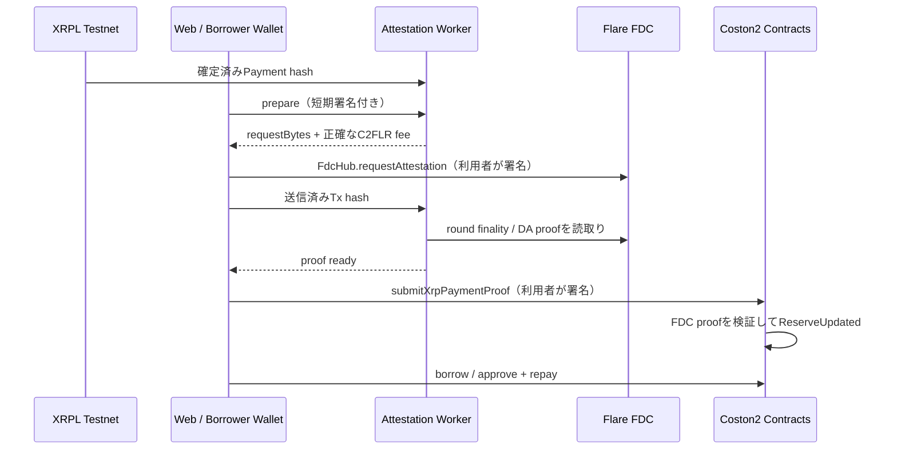

# ReserveFlow Credit デモンストレーション手順書

この手順書は、Flare Summer Signal向けにReserveFlow Creditを**実ネットワークのCoston2 / XRPL Testnetだけで**実演するための進行台本です。

> 対象はテスト用rfUSD、Coston2（chain ID `114`）、XRPL Testnet、FDC `XRPPayment`です。実資産・mainnet・本番融資を扱いません。秘密鍵、XRPL seed、FDC Verifier APIキーを画面共有・ログ・リポジトリへ出してはいけません。

## 1. デモで伝える一文

> **ReserveFlow Creditは、XRPL Testnetで起きた支払いをFlare Data Connectorで検証し、検証済み準備金だけを根拠にテスト用rfUSDの信用枠を扱う、非カストディアルな信用プロトコルです。**

見せる因果関係は次のとおりです。



強調点は「WorkerはVerifier APIキーを扱うが、**利用者の秘密鍵・C2FLR・rfUSDの送信権限を一切持たない**」ことです。

## 2. 所要時間と役割

| 区分 | 所要 | 担当 | 実施内容 |
| --- | ---: | --- | --- |
| 事前準備 | 15〜30分 | オペレーター | 環境変数、デプロイ、承認、残高、接続を確認 |
| 本編 | 5〜7分 | 話者 + オペレーター | FDC request → proof → Core検証 → 借入・返済 |
| FDC待機 | 90〜180秒目安 | 話者 | 状態機械・安全境界・コントラクトを説明 |
| 予備 | 2分 | オペレーター | RPC / DA Layer遅延時の復旧または録画提示 |

役割を分けられる場合は、話者が画面共有と説明、オペレーターがウォレット署名とターミナル監視を担当します。

## 3. デモ開始前チェックリスト

### ネットワーク・資金

- [ ] ブラウザウォレットがCoston2（chain ID `114`）へ接続できる。
- [ ] 借入者ウォレットにFDC request feeとガス用の少量C2FLRがある。
- [ ] XRPL Testnet送信用アカウントに十分なtest XRPがある。
- [ ] 新しいXRPL Testnet Paymentを使用する。既に`ReserveFlowCore`へ提出済みのhashはreplayとして拒否される。
- [ ] Paymentが`tesSUCCESS`で、少なくとも3 XRPL ledger確定済みである。

### Coston2の状態

- [ ] `ReserveFlowCore`、`CreditVault`、rfUSDの今回のデプロイアドレスを控えた。
- [ ] 借入者は`approvedBorrowers`として承認済みである。
- [ ] XRPL addressに対応するreserve accountを登録し、Risk Adminが`ACTIVE`へ承認済みである。
- [ ] credit lineを開設済み、またはデモ内で「信用枠を開設」を押す段取りにしている。
- [ ] Vaultへテスト用rfUSD流動性がある。
- [ ] FTSO価格とreserve freshnessが`HEALTHY`になる条件を満たす。

> 初回のデモでは、reserve accountのRisk Admin承認だけは事前に済ませるのがおすすめです。Admin操作を本編に含める場合は、別ウォレット・別署名が必要になり、説明の焦点がFDCから外れます。

### Worker / Webの環境変数

`.env`にはWorker専用の値を入れます。

```dotenv
COSTON2_RPC_URL=https://coston2-api.flare.network/ext/C/rpc
COSTON2_DA_LAYER_URL=https://ctn2-data-availability.flare.network
FDC_VERIFIER_URL_TESTNET=https://fdc-verifiers-testnet.flare.network
FDC_VERIFIER_API_KEY_TESTNET=***
RESERVE_FLOW_CORE_ADDRESS=0x...
ATTESTATION_DATABASE_PATH=./data/attestations.sqlite
ATTESTATION_WORKER_PORT=8787
ATTESTATION_ALLOWED_ORIGIN=http://localhost:3000
```

`apps/web/.env.local`には公開してよい値だけを入れます。

```dotenv
NEXT_PUBLIC_COSTON2_RPC_URL=https://coston2-api.flare.network/ext/C/rpc
NEXT_PUBLIC_ATTESTATION_WORKER_URL=http://localhost:8787
NEXT_PUBLIC_RESERVE_FLOW_CORE_ADDRESS=0x...
NEXT_PUBLIC_FDC_HUB_ADDRESS=0x...
NEXT_PUBLIC_CREDIT_VAULT_ADDRESS=0x...
NEXT_PUBLIC_RFUSD_ADDRESS=0x...
```

- [ ] `FDC_VERIFIER_API_KEY_TESTNET`に有効なTestnet APIキーを設定した。
- [ ] `ATTESTATION_ALLOWED_ORIGIN`とWebのOriginが完全一致する。
- [ ] Workerへ`BORROWER_PRIVATE_KEY`を設定していない。
- [ ] Vercelを使う場合、Worker URLはHTTPSであり、公開OriginとCORS設定が一致する。

## 4. 起動手順

### ターミナルA: Worker

```sh
set -a; source .env; set +a
pnpm --filter @reserveflow/attestation-worker serve:attestations
```

期待する表示:

```text
ReserveFlow attestation API listening on port 8787.
```

可能なら別ターミナルでread-only smokeも確認します。

```sh
set -a; source .env; set +a
export COSTON2_FDC_SMOKE_CONFIRM='READ_COSTON2_FDC'
pnpm --filter @reserveflow/attestation-worker smoke:coston2-fdc
```

### ターミナルB: Web

```sh
pnpm --filter @reserveflow/web dev
```

`http://localhost:3000` を開き、Coston2ウォレットを接続します。設定またはネットワークが違う場合は、送信ボタンを押さずに修正します。

## 5. 本編台本（5〜7分）

### 0:00–0:40 — 問題と境界

画面: Webトップ画面。

話すこと:

> クロスチェーンの準備金を、そのまま信用判断に使うことはできません。ReserveFlowはXRPL上の支払いをFDCで証明し、Coston2のコントラクトが検証してから初めて準備金を更新します。

画面で示すこと:

- `Coston2 · 114`
- `XRPL Testnet XRP`
- test rfUSD only の注意書き

### 0:40–1:20 — 準備金アカウントと信用枠

画面: XRPL classic address入力欄。

1. 登録済み・承認済みのXRPL addressを入力する。
2. 初回だけ「準備金アカウントを登録」を押して借入者ウォレットで署名する。
3. Risk Adminが承認済みであることを説明する。
4. 初回だけ「信用枠を開設」を押して署名する。

話すこと:

> 準備金アカウントは借入者とXRPL addressへ束縛されます。誰でも他人の準備金を担保にできる設計ではありません。

### 1:20–2:00 — XRPL PaymentをFDCへ申請

1. 新しい確定済みXRPL Testnet Payment hashを入力する。
2. 「ウォレットでFDC申請」を押す。
3. ウォレットで`FdcHub.requestAttestation`を確認する。
   - `requestBytes`はWorkerがVerifierから得たもの。
   - C2FLR valueはWorkerが読んだ**正確なfee**。
4. 署名・送信する。

期待する画面表示:

```text
FdcHub申請を接続ウォレットから送信しました。
ラウンド確定後に証明を取得してください。
```

話すこと:

> ここでfeeを支払うのは利用者の接続ウォレットです。Workerは署名せず、送信後のreceiptを照合するだけです。

### 2:00–4:30 — FDC round待機中の説明

FDC round確定には通常90〜180秒程度かかります。待機中は、早送りせずに安全性を説明します。

1. 「証明を確認・Coreへ提出」を押す。
2. `FDC round is not finalized` / `FDCラウンドの確定待ち`なら正常であると伝える。
3. 次の状態を説明する。

| 状態 | 意味 | 次の操作 |
| --- | --- | --- |
| `READY_TO_SUBMIT` | request bytesとfeeを準備済み | ウォレットでFdcHubへ送信 |
| `SUBMITTED` / `WAITING_FINALIZATION` | receipt照合済み、FDC確定待ち | 少し待ってrefresh |
| `PROOF_READY` | DA Layerからproofを取得 | 借入者ウォレットがCoreへ提出 |
| `VERIFIED` | `ReserveUpdated`イベントを確認済み | 信用操作が可能か確認 |

話すこと:

> DA Layerから届くproofも、まだ信頼していません。`ReserveFlowCore`がFlareの`FdcVerification.verifyXRPPayment`を実行して初めて、オンチェーン準備金として扱います。

### 4:30–5:30 — ProofをCoreへ提出

1. 再度「証明を確認・Coreへ提出」を押す。
2. `PROOF_READY`になった場合、ウォレットで`submitXrpPaymentProof`を確認して署名する。
3. UIが`ReserveFlowCoreで準備金証明を検証しました。`へ変わることを確認する。
4. Coston2 ExplorerでCore transactionを開き、`ReserveUpdated`イベントを見せる。

話すこと:

> ここが信頼境界です。proof owner、sourceの`testXRP`、成功status、XRPL address hash、replay、ledger順序をCoreが検査します。失敗すれば準備金状態は変わりません。

### 5:30–6:30 — 借入と返済

1. 少額のrfUSDを入力し、「借入内容を確認」後に「ウォレットで借入を実行」を押す。
2. ウォレットで`CreditVault.borrow`を署名する。
3. Coston2 Explorerで`Borrowed`イベントを確認する。
4. 同額以下を返済額に入力し、「承認して返済を実行」を押す。
5. rfUSD `approve`、続けて`CreditVault.repay`を署名する。
6. `Repaid`イベントを確認する。

話すこと:

> 借入はfreshなFDC reserveとFTSO価格がそろった`HEALTHY`状態だけで可能です。一方、返済はリスク状態が悪化しても維持します。

### 6:30–7:00 — 締め

> ReserveFlowは、外部チェーンの出来事を「表示上の情報」ではなく、FDCで検証済みの信用判断の入力に変えます。しかもVerifier APIを使うWorkerは鍵を持たず、fee・proof・借入・返済の署名は常に利用者のウォレットに残ります。

## 6. 実演中に必ず見せる根拠

| 主張 | 画面またはExplorerで見せる根拠 |
| --- | --- |
| XRPL Paymentが存在する | XRPL Testnet Explorerの`tesSUCCESS` transaction |
| FDC request feeは利用者負担 | ウォレットのFdcHub TxとC2FLR value |
| Workerは鍵を持たない | Worker環境変数例と`serve:attestations`の起動ログ |
| proofはオンチェーン検証される | Core Txと`ReserveUpdated`イベント |
| 信用操作はユーザー署名 | `Borrowed` / `Repaid`イベントとウォレット確認 |
| 安全な拒否がある | `NOT_FINALIZED`待機、またはreplay/staleのテスト映像 |

> 現在のダッシュボード数値には表示用スナップショットも含まれます。デモでは数値カードの更新を根拠にせず、**ウォレット確認、Worker状態、Coston2 Explorerのイベント**を真実の根拠として示してください。

## 7. 失敗時の対応

| 症状 | その場の対応 | やってはいけないこと |
| --- | --- | --- |
| `temREDUNDANT` | 新しいXRPL Testnet Paymentを作る | 同じ送金を何度も再送しない |
| `401 Unauthorized` | Workerの`FDC_VERIFIER_API_KEY_TESTNET`のみ確認する | APIキーを表示・貼り付けしない |
| `NOT_FINALIZED` | 30〜60秒後に再度refreshする | FdcHub requestを再送して二重feeを払わない |
| DA Layer `400` / `503` | round確定待ち、WorkerログとRPCを確認する | proofを手作業で改変しない |
| Core Txがrevert | Explorerのrevertを確認し、別の未使用・成功済みXRPL Paymentでやり直す | fixtureや失敗Tx hashを提出しない |
| `STALE_PRICE` / `STALE_RESERVE` | 借入は中止し、freshな状態を待つ | stale状態で借入可能だと説明しない |

FDC待機が長い場合は、前もって撮影した**同一フローの録画**へ切り替え、「現在はround finalization待ちであり、再送はしない」と明示します。録画を実ネットワーク実行であるかのように偽装してはいけません。

## 8. デモ後の確認

- [ ] FdcHub request transaction hashを保存した。
- [ ] Core proof transaction hashと`ReserveUpdated`イベントを保存した。
- [ ] `Borrowed`と`Repaid`のtransaction hashを保存した。
- [ ] Explorerリンク、短い画面録画、スクリーンショットをDevpost提出素材へ追加した。
- [ ] 使用したXRPL hash、Core hash、デプロイアドレスをREADMEのデモ欄へ追記した。
- [ ] `.env`、seed、private key、API key、SQLite DBをGitへ追加していないことを確認した。

## 9. 提出直前のコマンド

```sh
pnpm typecheck
pnpm test
pnpm --filter @reserveflow/attestation-worker test
pnpm --filter @reserveflow/web test
pnpm check
pnpm --filter @reserveflow/web build
```

コントラクトテストも通常は実行します。

```sh
pnpm --filter @reserveflow/contracts test
```

macOS環境でFoundryがsystem proxy初期化に失敗する場合は、環境起因であることを切り分けたうえで、別のCIまたはローカル環境で再実行します。
