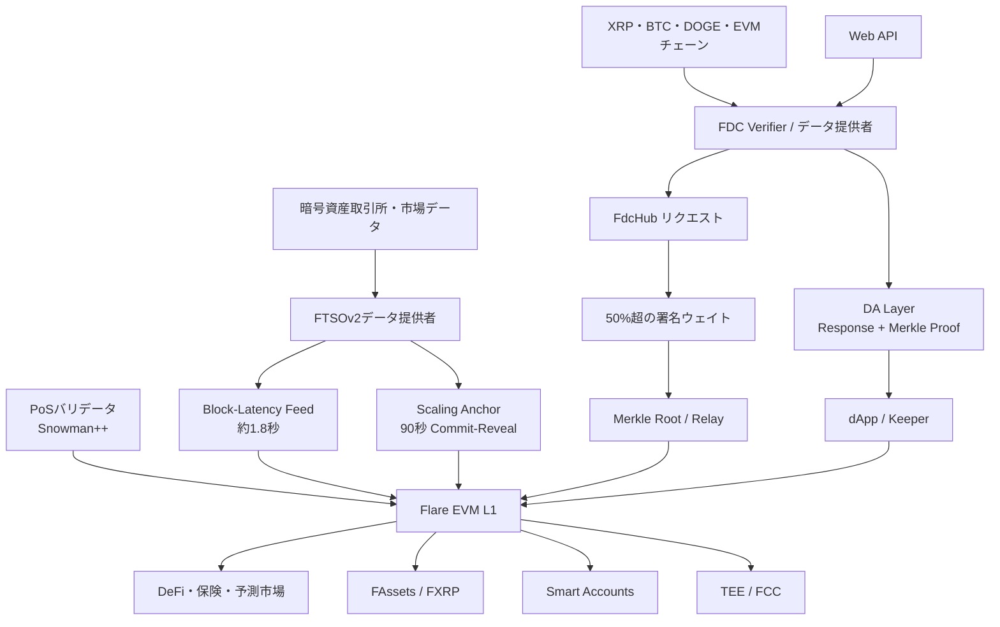
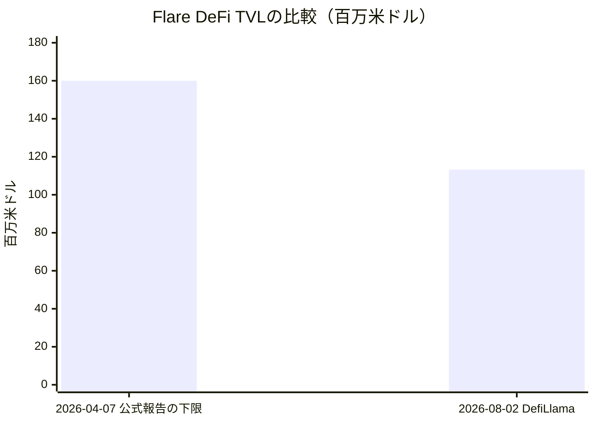
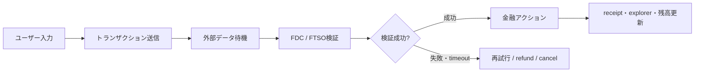
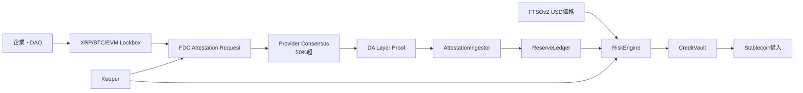
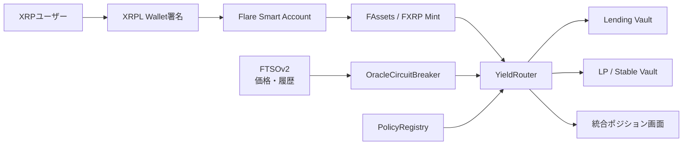
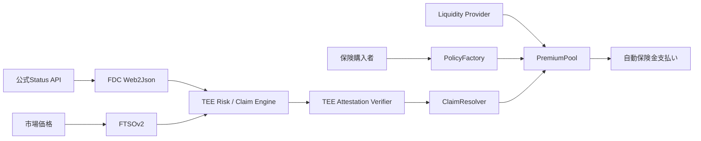
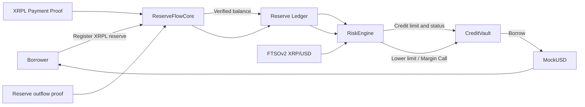
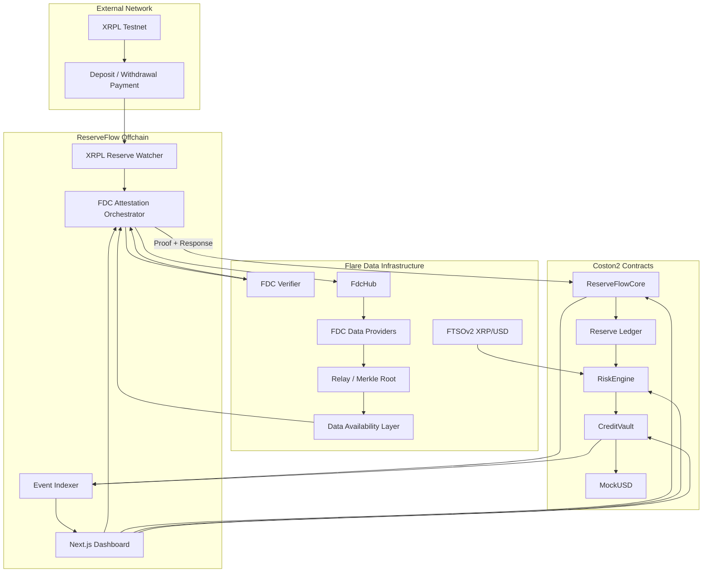
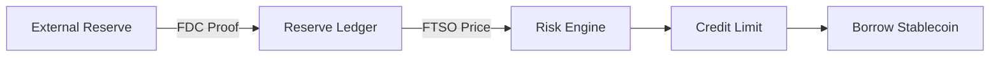

# ReserveFlow Creditとは？

ReserveFlow Creditは、**ほかのブロックチェーンに持っているお金を、動かさずに「信用」として使えるサービス**です。

たとえば、あなたが別の場所に100万円分のお金を持っているとします。

でも、そのお金を使うためには、売ったり、別の場所へ送ったりしなければならないことがあります。

ReserveFlow Creditでは、

> 「この人は、本当にこれだけのお金を持っています」
> 

ということをコンピューターが確認し、その金額に合わせてお金を借りられるようにします。

---

## 解決したいこと

今のブロックチェーンの世界では、たくさんのお金を持っていても、別のチェーンにあると、そのお金をうまく活用できないことがあります。

銀行にたとえると、

> 別の町の銀行に貯金があるのに、今いる町の銀行では「その貯金は確認できません」と言われる
> 

ような状態です。

そのため、持っているお金を一度売ったり、別の場所へ移したりする必要があります。

しかし、お金を移すと、

- 手数料がかかる
- 時間がかかる
- 送る途中でトラブルが起きるかもしれない
- 売りたくないお金まで売らなければならない

という問題があります。

ReserveFlow Creditは、**お金をその場所に置いたまま、本当に持っていることを証明して、信用として使えるようにする**ことで、この問題を解決します。

---

## どのような仕組み？

ReserveFlow Creditは、次のように動きます。

### 1. 持っているお金を確認する

まず、XRPなどのお金を本当に持っているか確認します。

これは先生が、

> 「宿題をやったと言うだけではなく、ノートを見せてください」
> 

と確認するのと似ています。

FlareのFDCという仕組みを使って、お金が送られた記録や動いた記録が本物かを確認します。

### 2. 今の値段を調べる

次に、そのお金が今いくらなのかを調べます。

たとえば、

- 1 XRPが100円
- 10,000 XRPを持っている
- 合計で100万円分

というように計算します。

値段はFlareのFTSOという仕組みから取得します。

### 3. 借りられる金額を決める

持っているお金の全部を借りられるわけではありません。

値段が下がっても困らないように、安全のため少なめに計算します。

たとえば、100万円分のXRPを持っていても、

> 「安全を考えて、借りられるのは35万円までです」
> 

というように限度額を決めます。

### 4. お金を借りる

決められた限度額の中で、ステーブルコインを借りられます。

元のXRPは、売ったり別のチェーンへ送ったりせず、そのまま残しておけます。

---

## アピールポイント

### お金を移動させなくてよい

XRPなどの資産を売ったり、別のブロックチェーンへ送ったりせずに使えます。

### 本当に持っているか確認できる

「持っています」と言うだけではなく、ブロックチェーンの記録を使って確認します。

### 値段に合わせて借りられる金額が変わる

持っている資産の値段が上がれば、借りられる金額も増える可能性があります。

反対に値段が下がった場合は、安全のため借りられる金額を減らします。

### お金が動いたことも反映できる

資産を追加すると信用が増えます。

資産を外へ送ると信用が減り、借りすぎている場合は警告を出します。

### Flareの2つの技術を組み合わせている

- **FDC**：ほかのブロックチェーンで起きたことを確認する
- **FTSO**：資産の現在の値段を調べる

この2つを組み合わせて、確認した情報を実際の金融サービスにつなげます。

---

## ReserveFlow Creditでできること

- XRPなどの資産を登録する
- 本当に資産を持っているか確認する
- 資産の現在価格を調べる
- 資産が全部でいくらになるか計算する
- 安全に借りられる金額を計算する
- ステーブルコインを借りる
- 借りたお金を返す
- 資産が減った場合に限度額を減らす
- 借りすぎている場合に警告を出す
- 同じ証明を何度も使う不正を防ぐ
- 古い情報や正しくない証明を受け付けない

---

## 具体的な例

ある会社が、100万円分のXRPを持っているとします。

ReserveFlow Creditがその資産を確認し、安全のため計算した結果、35万円まで借りられることになりました。

会社はXRPを売らずに、20万円分のステーブルコインを借ります。

その後、会社がXRPの半分を別の場所へ送った場合、持っている資産は50万円分になります。

すると借りられる限度額も小さくなり、

> 「今のままだと借りすぎています。追加では借りられません」
> 

という警告が表示されます。

このように、持っている資産の変化に合わせて、信用も自動で変わります。

---

## 一言で説明すると

> ReserveFlow Creditは、別のブロックチェーンにある資産を動かさずに、その資産を持っている証明を使って、お金を借りられるようにするサービスです。
> 

もっと短く言うと、

> **持っている暗号資産を売らずに、信用として使える仕組みです。**
> 

---

## このアイディアが目指す未来

将来は、会社やDAOなどが、いろいろなブロックチェーンに持っている資産をまとめて信用として使えるようにします。

XRPだけでなく、Bitcoinやほかの資産にも対応することで、

> 「世界中のブロックチェーンにある資産を、ひとつの信用として活用できる」
> 

未来を目指します。

# Flare Network ハッカソン準備のための技術・市場・戦略調査報告書

## エグゼクティブサマリー

**Flareは「高速なEVMチェーン」そのものを主要な差別化点とするのではなく、価格・時系列データ、外部チェーンのトランザクション、Web APIの応答などを、ネットワーク内蔵型のデータプロトコルとしてスマートコントラクトへ供給するデータ特化型レイヤー1である。** Snowman++とPoSを用いるEVMチェーンに、Flare Time Series Oracleの最新版であるFTSOv2、外部データを検証するFlare Data Connector、クロスチェーン資産化を担うFAssets、XRPL署名でFlare上のアカウントを操作するFlare Smart Accounts、TEEベースのFlare Confidential Computeを組み合わせている。約1.8秒のブロック時間、単一スロット・ファイナリティ、CancunまでのEVM opcode対応という実行環境に加え、バリデータがデータ提供者を兼ねることが特徴である。citeturn18view0turn18view1turn18view2turn20search2

ハッカソンの観点では、単にSolidityアプリをFlareへ移植するだけでは競争力が弱い。過去の受賞作は、FTSOを価格表示に使うだけでなく、FDCによる外部イベント検証、FAssetsによるXRP・BTC等の流動化、LayerZero等によるクロスチェーン配送、Smart Accountsによる非EVMユーザーのオンボーディング、TEEによる秘密計算を、**一つの理解しやすいユーザーフローに統合したプロジェクト**が強い。RampNet、MultisigPE、kleos、Bridge.flare、Sepiaなどは、このパターンを明確に示している。citeturn16view0turn16view1turn16view3turn7view0turn8view1

技術的な最重要ポイントは次の通りである。

| 判断項目 | 結論 |
|---|---|
| 最もFlareらしい機能 | FTSOv2、FDC、FAssets、Smart Accounts、TEE/FCCの組合せ |
| 開発者にとっての参入障壁 | EVM部分は低いが、FDCの非同期ラウンド、DA Layer、Merkle proof、データ鮮度管理は学習が必要 |
| 最大の競争優位 | Oracleやクロスチェーン証明をアプリ別の外部サービスではなく、ネットワーク内蔵機能として使えること |
| 最大の弱点 | Ethereum、Arbitrum、BSC等より流動性、ユーザー数、既存プロトコル数、開発者ネットワークが小さい |
| セキュリティ上の核心 | L1コンセンサスだけでなく、FTSO/FDC提供者、DA Layer、対象チェーン、FAssetsエージェント、ガバナンス、TEE等の複合的信頼境界 |
| 最適なハッカソン領域 | XRPFi、クロスチェーン担保・決済、予測市場、保険、財務管理、検証可能AI、Oracleネイティブなデリバティブ |
| 推奨MVP | 一つの外部証明、一つの金融アクション、一つの明確な失敗時処理を、Coston2上でエンドツーエンドに動かす |
| 推奨上位案 | クロスチェーン準備金連動型与信、XRPL署名だけで使えるリスク制御型Yield Vault、TEE・FDC連動型パラメトリック保険 |

定量的には、2026年8月2日時点でDefiLlamaが示すFlareのDeFi TVLは約1億1,322万ドル、ステーブルコイン時価総額は約4,718万ドル、24時間DEX出来高は約217万ドル、24時間アクティブアドレスは約3,998、24時間トランザクションは約45万6,140件である。一方、Flare公式は2026年4月7日時点で標準的なTVLを1億6,000万ドル超、広義の預かり資産を約4億ドルと報告していた。したがって、エコシステムは実需を持つ段階に達しているが、TVLはまだ変動が大きく、Ethereum L2やBSCのネットワーク効果と同等とは評価できない。citeturn18view5turn11search3

本報告書の調査基準日は**2026年8月2日、日本時間**である。ライブのバリデータ数、瞬間的TPS、最新のFXRP供給量など、公式ダッシュボードで常時変動する値については、固定値を無理に提示せず「未公表または変動値」とした。

## Flareの全体像、歴史、組織、トークン設計

**目的とポジショニング。** Flareは自身を「The blockchain for data」と位置づけ、データ集約型ユースケース向けのフルスタックL1として設計されている。初期の構想は、XRP、BTC、DOGEなどスマートコントラクトをネイティブに持たない資産をEVM上で利用可能にすることに強く焦点を当てていたが、現在の製品構成は、金融資産だけでなく、EVMチェーン、非EVMチェーン、Web2 API、AI・TEE計算までを検証可能なデータとして扱う方向に拡張されている。日本語圏では「XRPにスマートコントラクト機能をもたらすネットワーク」と説明されることが多かったが、現在はそれより広い「データ内蔵型L1」と理解すべきである。citeturn20search2turn17search0turn17search1

**歴史。** Flareは2019年頃に始動し、Hugo Philion、Sean Rowan、Naïri Usherが共同創業者として記録されている。最初のホワイトペーパーは2020年に公開され、Rippleの投資部門Xpringからも初期支援を受けた。メインネットは2022年7月に稼働し、2023年1月9日に最初のFLRトークン配布が実施された。旧称SparkはFLRへ変更された。2025年には旧State Connectorの後継・発展形としてFDCが本格導入され、2025年9月にはFXRPを中心とするFAssetsがFlareメインネットで開始された。2026年にはFIP.16、Flare Smart Accounts、Flare Confidential Computeなど、データ・資産・秘密計算を統合する「Flare 2.0」方向の機能拡張が進んでいる。citeturn2search10turn1search4turn1search5turn4search4turn12search16turn20search4

| 時期 | 主な出来事 | ハッカソン上の意味 |
|---|---|---|
| 2019年頃 | プロジェクト始動 | XRP等、非スマートコントラクト資産の利用が原点 |
| 2020年 | 初期ホワイトペーパー、XRPスナップショット | FLR配布とXRPコミュニティ形成 |
| 2022年7月 | Flareメインネット稼働 | EVM L1としての実運用開始 |
| 2023年1月 | 初回FLR配布 | ガス、委任、ガバナンスの実運用 |
| 2024年 | FTSOv2、FAssetsテスト、ハッカソン拡大 | 高頻度OracleとXRPFiの基礎形成 |
| 2025年 | FDC、FXRP、FAssetsメインネット | 外部証明と実資産を使うアプリが現実的に |
| 2026年 | FIP.16、Smart Accounts、FCC/TEE拡張 | 一署名UX、秘密計算、AI連携が新しい差別化領域 |

この年表は、Flareが「XRP向けEVM」から「検証可能データと資産のフルスタック基盤」へ段階的に拡張してきたことを示す。citeturn4search7turn12search3turn12search16turn20search4

**主要組織。** Flare Foundationは、プロトコルガバナンス、助成、エコシステム支援、インフラ普及に関与する中心的な財団である。Flare LabsはFAssetsをはじめとするプロダクト・研究開発を担当していることが公式資料から確認できる。Hugo Philionは少なくとも2025年時点の公式発表で共同創業者兼CEOとして記載されている。創業メンバー以外を含む完全な最新組織図と各法人の厳密な法的役割分担は、公開資料では**未公表（unspecified）**である。citeturn20search0turn20search3turn20search4turn18view4

**資金調達。** 2021年にはKenetic Capital主導で約1,130万ドルを調達し、CoinFund、Digital Currency Group、cFund、Wave Financialなどが参加したと報じられた。2024年には約3,500万ドルのラウンドが報じられ、2025年時点の累計外部調達額を約4,630万ドルとする報道がある。これらは企業・財団の完全な財務開示ではなく、報道ベースの数字である。citeturn2search11turn2search13turn2search9

**FLRの役割。** FLRはガス、PoSステーキング、バリデータへの委任、FTSO提供者への委任、ガバナンス、プロトコル報酬、FAssets関連の経済設計に使われる。WFLRはFLRを1対1でラップしたERC-20互換表現で、スマートコントラクト上の委任やガバナンス参加を可能にする。FlareではLegacy型とEIP-1559型の両トランザクションにおいて、支払われたトランザクション手数料はすべてバーンされる。citeturn18view0turn20search1turn1search5

| 設計項目 | 内容 | 分析 |
|---|---|---|
| ジェネシス配布量 | 1,000億FLR | 初期配布、チーム、財団、投資家等を含む |
| ガバナンス可能比率 | 初期配布量の80.2% | Foundation・VC Fund保有分19.8%は投票不可とされた |
| 初回配布 | 対象割当の15% | 2023年1月9日に実施 |
| 残余配布 | 36か月にわたりWFLR保有者へ配布 | FIP.01により受領条件をWFLR保有へ変更 |
| 配布完了時の設計値 | 流通可能93.9B、総供給110.1B | 総供給の約85%が流通可能になる設計値 |
| インフレ | FIP.16で年率5%から3%へ削減、年30億FLR上限 | 2026年採択。ただし全機能の実装は段階的 |
| 手数料 | 全額バーン | 利用増が供給増を部分的に相殺 |
| FIRE | プロトコル収益をFLR価値へ還元する枠組み | FIP.16の一部。実装状況は機能ごとに確認が必要 |

トークン分配と供給値は、公式資料に記された配布完了時の設計値であり、2026年8月2日時点のリアルタイム供給量そのものではない。FIP.16は2026年4月に98.06%の支持で承認されたが、公式ドキュメント自身が、インフレ削減、FIRE、MEV収益化等のすべてが同時に完全稼働したわけではないと注意している。citeturn20search1turn1search3turn18view3turn13view1

投資判断では、単純な「最大供給量固定型」トークンとして扱うべきではない。FLRには継続的発行、FTSO・FDC・ステーキング報酬、プロトコル報酬、バーン、将来のFIRE収入という複数のフローがあり、供給増とネットワーク利用の双方を見る必要がある。ハッカソンではトークン価格を中心に据えるより、FLRを**ガス、委任、データセキュリティ、インセンティブの統合資産**として説明する方が正確である。citeturn18view0turn18view3turn1search3

## 技術的特異点と開発実務

Flareの基本アーキテクチャは、EVM実行層とSnowman++コンセンサスに、FTSO、FDC、Secure Random、FAssets等の「enshrined protocol」を組み込んだ構成である。通常のEVMチェーンでは、価格Oracle、ブリッジ、外部API検証は独立した第三者プロトコルとして導入される。Flareでは、バリデータがFTSO・FDCのデータ提供者も兼ね、データプロトコルがネットワークの報酬・委任・経済セキュリティに接続される。citeturn18view0turn18view1turn18view2



**コンセンサス。** FlareはAvalanche系のSnowman++を採用し、PoSでSybil耐性を確保する。ブロック時間は約1.8秒で、ブロックがコンセンサスに受理された時点で最終とみなす単一スロット・ファイナリティを採用する。ブロック提案者は総ステークに応じて選ばれ、デフォルトのトランザクション順序はpriority gas auctionである。Snowman系はランダムサンプリングにより高速な合意を形成するため、Ethereumの12秒スロット・複数epochファイナリティより低遅延である。citeturn18view0turn19view3turn19view0

ただし、「単一スロット・ファイナリティ」は、データプロトコルの応答も必ず1.8秒で完結することを意味しない。FTSOの高速フィードはブロック単位で更新される一方、FDCはリクエスト、投票ラウンド、Merkle root確定、DA Layerからのproof取得という非同期処理を必要とする。したがって、価格依存トレードは低レイテンシにできるが、クロスチェーン決済・Web API証明は数ブロック以上の待ち時間を前提としたUXにする必要がある。citeturn18view1turn18view2

**FTSOv2。** Flare Time Series Oracleは、Flareのコアに組み込まれた時系列Oracleである。FTSOv2は最大1,000フィード、約2週間の履歴、暗号資産・株式・商品等のデータをサポートし、各フィードはおおむね100の独立したデータ提供者に支えられる。Block-Latency Feedは各ブロック、約1.8秒ごとに更新され、オンチェーン参照は無料である。citeturn18view1

高速更新では、各ブロックでstake-weighted VRFによりデータ提供者を選び、期待サンプル数は通常1である。選ばれた提供者は前値に対して上昇、低下、変更なしのデルタを送信し、基本刻み幅は \(1/2^{13}\)、約0.0122%である。極端なボラティリティ時は、誰でも料金を支払って期待サンプル数を一時的に増やすVolatility Incentiveを起動できる。長期的なドリフトは、全提供者による90秒ごとのcommit-revealとIQR計算を使うScaling Feedで補正する。citeturn18view1

この構造には明確な設計上の交換条件がある。通常時の価格追従は非常に速く低コストだが、1ブロック当たりの期待サンプル数が小さいため、単一更新を無条件に清算や全資金移動へ接続すべきではない。アプリ側では、最終更新時刻、価格変化率、Scaling Anchorとの差、複数ブロックTWAP、最大ポジション、緊急停止を組み合わせるべきである。これはFTSOの欠陥というより、低遅延Oracleを金融契約へ接続する際の一般的な防御設計である。FTSO公式もフィード安定性・リスクを独立した開発テーマとして扱っている。citeturn18view1turn14view0

**FDCと旧State Connector。** 初期設計のState Connectorは、外部チェーンの状態について分散的に合意し、Flare上で使用可能にする機能だった。FIP.12により、これを拡張・置換する形でFlare Data Connectorが導入された。現在のFDCは、ユーザーが外部データのattestation requestをFdcHubへ送信し、データ提供者が検証し、50%を超える署名ウェイトを獲得したレスポンス群をMerkle treeへまとめ、rootだけをRelayコントラクトへ保存する。利用者はDA LayerからレスポンスとMerkle proofを取得し、対象コントラクトへ提出する。citeturn4search4turn18view2

現行FDCは、AddressValidity、EVMTransaction、Web2Json、Payment、ConfirmedBlockHeightExists、BalanceDecreasingTransaction、ReferencedPaymentNonexistenceの7種類を公式にサポートする。PaymentはBTC、DOGE、XRP、EVMTransactionはETH、FLR、SGB等、Web2JsonはWeb API応答をJQで変換してABIエンコードする。2026年8月時点でWeb2JsonはCostonとCoston2のみと明記され、メインネット提供時期は**未公表（unspecified）**である。多くのチェーンデータは証明リクエスト可能な最大経過時間が14日だが、作成済みproofは継続して利用可能である。citeturn18view2

FDCの重要な理解点は、Merkle proofが証明するのは「FDC提供者の合意によって確定したレスポンスがRelayのrootに含まれること」であり、Ethereumのlight-client proofやゼロ知識証明のように、外部チェーンのコンセンサスをFlare上で直接再検証する方式ではないことである。FDC提供者の過半署名、verifier実装、対象RPC/API、対象チェーンのfinality、検閲耐性が信頼境界に含まれる。OpenZeppelinのFAssets監査も、FDCの共謀・検閲耐性をFAssetsの基礎的な外部信頼仮定として挙げている。citeturn18view2turn14view0

**Secure Random。** Flareのランダム値はデータ提供者のcommit-revealを集約し、少なくとも一つの参加者が秘密値を正しく保持していれば予測耐性を維持する設計である。結果には`isSecure`相当の判定が付随し、提出欠落や不整合がある場合には安全でないと判定できる。ゲーム、抽選、ランダム選択、Monte Carloのseedなどに適しているが、アプリは安全性フラグが偽の場合の再試行・キャンセル経路を実装すべきである。citeturn3search3

**EVM互換性と実行。** FlareはEthereumと同じ20-byte ECDSAアドレスを使用し、EIP-2718、RLP、Legacy型、EIP-1559型トランザクションをサポートする。Solidity、Vyper等で書かれたコントラクトを展開でき、Ethereum JSON-RPC APIとCancunまでのEVM opcodeに対応する。したがって、OpenZeppelin Contracts、Foundry、Hardhat、ethers、viem、wagmi等の一般的なEVMスタックを再利用できる。citeturn18view0turn11search1

一方、完全な「Ethereumと同一の運用環境」ではない。Flare固有機能を使う場合は、ContractRegistryからシステムコントラクトを解決し、FTSOのfeed ID、FDCのattestation response、Relay proof、DA Layer API、ネットワーク別アドレスを扱う必要がある。コントラクトアドレスを直接ハードコードするより、公式ContractRegistryパターンを使うべきである。citeturn3search1turn16view1

**スケーリング。** FlareのL1実行スケーリングは、約1.8秒ブロックとSnowman++の高速finalityを中心とする。公式資料には、2026年8月時点の持続可能なメインネット最大TPSや最大Mgas/sについて統一された保証値は示されておらず、**未公表（unspecified）**である。FTSOの「Scaling Feed」はOracle集約方式の名称であり、EVM実行をロールアップするスケーリング技術ではない。ハッカソンのピッチで両者を混同してはならない。citeturn18view0turn18view1

**セキュリティ設計。** FlareではL1、Oracle、外部データ、資産ブリッジが一つの経済系に接続されるため、攻撃面も多層化する。

| 境界 | 主なリスク | 推奨防御 |
|---|---|---|
| Snowman++ / PoS | ステーク集中、バリデータ停止、提案者による順序付け | 最大スリッページ、deadline、commit-reveal、MEV耐性 |
| FTSOv2 | stale price、急変追従遅延、提供者偏り | freshness、TWAP、deviation bound、pause、position cap |
| FDC | 提供者共謀、verifier不具合、検閲、DA Layer停止 | proof再検証、複数DA endpoint、timeout、再要求、冪等処理 |
| 外部チェーン | reorg、finality差、RPC障害 | 十分なconfirmations、chain別policy |
| Web2Json | API所有者・DNS・TLS・レスポンス仕様変更 | 複数ソース、schema固定、JQ制限、domain allowlist |
| FAssets | Agent default、担保価格急落、清算不足、Core Vault依存 | 利用上限、流動性監視、depeg処理、退出経路 |
| ガバナンス | 管理鍵、アップグレード、パラメータ誤設定 | timelock、multisig監視、pause、権限制限 |
| TEE/FCC | ハードウェア脆弱性、attestation検証ミス、rollback | machine registry、nonce、code hash固定、再現可能計算 |

OpenZeppelinの2026年FAssets監査は、FTSO価格の遅延・操作、FDCの正しい動作、ガバナンス権限、エージェントの可用性、特定Core Vaultのカストディアン、対象チェーンの信頼性を主要な外部仮定として整理した。監査で検出された高重要度を含む問題は報告書上で修正状況が記録されているが、「監査済み」はOracle・経済モデル・外部カストディ・対象チェーンのリスク消滅を意味しない。citeturn14view0

**開発ネットワークとRPC。**

| ネットワーク | 役割 | Chain ID | 公開RPC |
|---|---|---:|---|
| Flare | 本番L1 | 14 | `https://flare-api.flare.network/ext/C/rpc` |
| Coston2 | Flare向け主要テストネット | 114 | `https://coston2-api.flare.network/ext/C/rpc` |
| Songbird | Canary network | 19 | `https://songbird-api.flare.network/ext/C/rpc` |
| Coston | Songbird向けテストネット | 16 | `https://coston-api.flare.network/ext/C/rpc` |

ネットワーク構成、RPC、DA Layer、FDC verifierは公式Developer Hubで提供されている。一般的なハッカソンではCoston2を第一候補とし、FAssetsや本番前機能の検証ではSongbird/Costonの対象バージョンを個別に確認するのが妥当である。citeturn18view0

| 開発領域 | 推奨ツール |
|---|---|
| コントラクト | Solidity、FoundryまたはHardhat、OpenZeppelin |
| フロントエンド | Next.js、TypeScript、viem、wagmi、RainbowKit |
| ウォレット | MetaMask、Bifrost Wallet、Luminite、Turnkey、Privy等 |
| インデックス | Goldsky、SQD、SubQuery、独自イベントIndexer |
| FTSO | ContractRegistry、FtsoV2Interface、feed ID、SecureRandom |
| FDC | FdcHub、verifier API、DA Layer、FdcVerification、Relay |
| ブリッジ | LayerZero/Stargate、zkBridge、対応OFT |
| テスト | Foundry fork/unit/fuzz、Coston2 integration、keeper障害試験 |
| 監視 | RPC health、Oracle freshness、FDC round、proof取得、残高・担保率 |

Flare Developer HubにはHardhat・Foundryスターター、ウォレット、ブリッジ、インデクサ、OFT、AI Skill/MCP等が集約されている。開発者体験は通常のEVMに近いが、FDCを使うバックエンドまたはkeeperは、リクエスト状態を永続化し、再起動後もproof取得を再開できるように設計すべきである。citeturn11search1turn18view0turn18view2

## エコシステムと定量評価

Flareのエコシステムは、Ethereumのような汎用アプリの巨大集合というより、**XRPFi、FAssets、OracleネイティブDeFi、クロスチェーンデータ、RWA、AI・TEE**を中心に形成されている。2024年以前はインフラとテストネットの比重が大きかったが、2025年のFXRP本番導入と2026年のSmart Accountsにより、実際のXRPをFlare上のDeFiへ持ち込む製品経路が具体化した。citeturn12search16turn12search3turn20search0

| 分野 | 主なプロジェクト・インフラ | 評価 |
|---|---|---|
| FAssets / XRPFi | FXRP、FAssets、Flare Smart Accounts | Flare固有性が最も強い中核領域 |
| DEX | SparkDEX、Enosys、BlazeSwap等 | FTSO連携、集中流動性、perps等 |
| Lending | Kinetic、Morpho Blue系市場 | FXRP・ステーブル資産の担保需要 |
| RWA / Credit | Clearpool、USDX、cUSDX | 実世界利回りとFAssets担保の接点 |
| Liquid staking | Firelight、stXRP系 | XRP利回り市場を狙うが、商品ごとのリスク確認が必要 |
| Oracle | FTSOv2、FDC、Secure Random | サードパーティ製品ではなくL1内蔵 |
| Bridge | FAssets、LayerZero/Stargate、zkBridge等 | 非EVM資産とEVM間の二層構造 |
| Wallet | Bifrost、MetaMask、Luminite、Turnkey等 | Smart AccountsでXRPLユーザーまで拡張 |
| NFT / Gaming | NFT市場、抽選、チケット、ゲーム系ハッカソン作品 | DeFiほど明確な主要TVLプロジェクトは少ない |
| AI / Confidential Compute | Flare AI Kit、FCE、FCC、TEE Node | 2025～2026年の新規性が高い領域 |

SparkDEX、Kinetic、Clearpool、RainDEXなどはFlare Grantsの代表例として公式に掲載されている。USDXとClearpoolのT-Poolは、ドル連動資産と米国短期国債由来の利回りをFlare DeFiへ接続する構成として導入された。ウォレットではLuminiteがTurnkeyを用いたembedded walletを提供し、2026年のSmart Accounts v1.3は、XRPL上の一回の署名からFXRPのmintと選択Vaultへのdepositまでを実行するUXを打ち出した。citeturn18view4turn20search8turn20search10turn5search13turn12search3

NFTについては利用例やハッカソン作品は存在するものの、2026年8月時点の主要な公式助成事例とDefiLlama上の資産規模ではDeFi、FAssets、RWA、DEX、Lendingが中心である。FlareでNFT単体のマーケットプレイスを作るより、FDCによる現実イベント証明、FTSO価格、Secure Random、クロスチェーン所有証明をNFTへ組み合わせる方が差別化しやすい。これは公開エコシステム構成に基づく本稿の分析である。citeturn18view4turn18view5turn8view1

**定量スナップショット。**

| 指標 | 2026年8月2日時点 | 注記 |
|---|---:|---|
| DeFi TVL | 約1億1,322万ドル | DefiLlama標準TVL |
| ステーブルコイン時価総額 | 約4,718万ドル | チェーン上のステーブル資産 |
| DEX出来高・24時間 | 約217万ドル | 日次変動が大きい |
| DEX出来高・7日 | 約2,492万ドル | 1日値より実態を見やすい |
| Perps出来高・24時間 | 約4.89万ドル | 現物DEXより小さい |
| アクティブアドレス・24時間 | 約3,998 | unique daily address指標 |
| 新規アドレス・24時間 | 約136 | DefiLlama定義 |
| トランザクション・24時間 | 約45万6,140件 | 金融以外のシステム処理を含み得る |
| チェーン手数料・24時間 | 約577ドル | 低手数料を反映 |
| アプリ手数料・24時間 | 約9,770ドル | アプリ側の収益・料金 |

数値はDefiLlamaの2026年8月2日スナップショットに基づく。アクティブアドレスとユーザー数は同義ではなく、一人が複数アドレスを持つ場合がある。累計ユーザー数、月間ユニーク人間数、地域別ユーザー数は統一された公式値が**未公表（unspecified）**である。citeturn18view5



Flare公式は2026年4月7日時点で、DefiLlamaの標準的な分類によるTVLを1億6,000万ドル超、より広い預かり資産を約4億ドル、アクティブアドレスを約88万、FXRP mint量を約1億5,000万単位と報告していた。8月2日のDefiLlama標準TVLは約1億1,322万ドルであるため、少なくとも春のピーク近辺からは減少している。ただし4月値は「超」とされた下限であり、広義TVLと標準TVLを混同してはならない。citeturn11search3turn18view5

2025年7月の公式集計では、Flareは累計約4,000万ブロック、約2億4,000万トランザクション、約390万ウォレットアドレス、日次45万件超のトランザクションを報告していた。この「累計ウォレットアドレス」は実ユーザー数ではないが、2026年8月の約45.6万日次トランザクションと比較すると、チェーン処理量は大きく崩れていない。一方、日次アクティブアドレスは約4,000であり、相当量の処理がプロトコル、bot、keeper、反復的なシステム処理である可能性が高い。後半は公開値からの推論である。citeturn5search15turn18view5

**助成とインキュベーション。** Flare Grantsは、21か国にまたがる100件の助成を公表し、トークン助成、技術・アドバイザリー、共同マーケティング、Google Cloudクレジットなどを提供している。Google Cloudクレジットは通常枠で最大20万ドル、AI関連で最大35万ドルと案内される。審査では、独自性、Flareエコシステムへの利益、実行能力、GTM、ロードマップ、FTSO/FDC統合、過去経験が重視される。小規模なCommunity Growth Grantには最大1万ドル、過去にはmulti-asset liquid staking/restaking向け50万ドルRFPも存在した。citeturn18view4turn11search2turn20search6

エコシステムの現状を一言で表すと、**技術基盤は成熟度を増しているが、アプリ・流動性・ユーザー獲得はまだ成長途上**である。これはハッカソン参加者にとって不利なだけではない。Ethereumで飽和した一般的なDEX、NFT、Lendingを再実装する価値は低いが、XRPユーザー向けのワンステップUX、FDCを使う現実イベント決済、FTSOネイティブなリスク管理、TEEを使う秘密計算では、カテゴリーリーダーになれる余地が大きい。

## 主要EVMチェーンとの比較

以下の性能値は、2026年8月2日時点の公式ドキュメントに基づく。ガス代はトランザクション種別、混雑、ネイティブトークン価格、L1 data feeで変わるため、固定ドル額ではなく相対評価とした。

| チェーン | 構造・合意 | ブロック・確定性 | EVM互換性 | コスト傾向 | データ・相互運用性 | セキュリティ上の主な特徴 | 適合ユースケース |
|---|---|---|---|---|---|---|---|
| **Flare** | 独立L1、Snowman++、PoS | 約1.8秒、単一スロットfinality | 高い。Cancunまで対応 | 非常に低い | FTSO・FDC・FAssets・Smart Accountsを内蔵 | L1経済セキュリティとデータ提供者を接続。ただしOracle/FDC/外部チェーンの複合リスク | XRPFi、Oracle DeFi、クロスチェーン証明、保険、AI/TEE |
| **Ethereum** | PoS L1、LMD-GHOST/Casper系 | 12秒slot、通常2epoch程度でfinality | 基準実装 | 高い | 外部Oracle・Bridgeをアプリが選択 | 最大級の経済セキュリティ、分散性、検証者・クライアント多様性 | 高価値決済、L2 settlement、最大流動性DeFi |
| **BSC** | EVM L1、PoS系validator set | 0.45秒block、通常約1.125秒finality | 非常に高い | 非常に低い | 大規模なEVMアプリ・CEX連携 | 高速だがvalidator集中・ガバナンス集中が主要トレードオフ | リテールDeFi、GameFi、高頻度アプリ |
| **Polygon PoS** | PoS sidechain、Bor/Heimdall | 1.5秒block | 高い | 非常に低い | AggLayer、Hyperlane、LayerZero等 | Bridge、validator、checkpoint、アップグレード境界 | 消費者アプリ、決済、ゲーム、大量処理 |
| **Avalanche C-Chain** | Snowman系PoS L1 | おおむねsub-second～約1秒finality | 高い | 低い | Avalanche L1、ICM | Flareと近い合意系。独自L1を構成可能 | 金融、機関向けチェーン、アプリ固有L1 |
| **Optimism** | Ethereum optimistic rollup、OP Stack | sequencerによる高速soft confirmation、L1 finalityは後段 | EVM equivalentだが差異あり | 低いがL1 data feeあり | Superchain、標準Bridge、cross-chain messaging | Ethereum settlementを利用する一方、sequencer、fault proof、upgrade、bridgeリスク | Ethereum資産・流動性を使う低コストアプリ |
| **Arbitrum** | Ethereum optimistic rollup、Nitro | sequencerによるsub-second級体感、L1確定は後段 | Gethベースで非常に高い | 低いがL1 posting feeあり | Arbitrum ecosystem、Orbit、messaging | Ethereum settlement、fraud proof。sequencer・bridge・upgrade境界 | 高流動性DeFi、デリバティブ、ゲーム、Orbit |

Flareの仕様は約1.8秒、単一スロットfinality、Snowman++、PoS、Ethereum形式トランザクション、Cancun互換である。Ethereumは12秒slot・32 slot epoch、BSCは0.45秒blockとFast Finality時約1.125秒、Polygon PoSは2026年6月に1.5秒block・160M block gas limitへ更新された。AvalancheのSnow系はランダムサンプリングとsub-second finalityを特徴とする。citeturn18view0turn19view0turn19view1turn19view2turn19view3

OptimismはEthereumと可能な限り同じ挙動を目指すEVM-equivalent設計だが、L1 data fee、非公開sequencer mempool、Unsafe/Safe/Finalized head、address aliasing等の差異がある。Arbitrum NitroはGethをEVM実行の基礎に置き、ArbOSがL2 fee、bridge、cross-chain messaging等を追加する。両者はEthereumのsettlement securityと流動性を利用できる一方、即時のsequencer確認とEthereum上の最終確定・出金確定を区別する必要がある。citeturn19view4turn19view5

**Flareの強み。**

| 強み | 技術的意味 | 競合との差 |
|---|---|---|
| Enshrined Oracle | FTSO/FDCがプロトコル報酬とvalidator/providerに接続 | 通常のEVMではChainlink等を別途選定 |
| 非EVM資産への焦点 | XRP、BTC、DOGEをFAssetsとしてDeFiへ接続 | L2は主としてEthereum資産・状態を継承 |
| 一署名XRPL UX | EVM wallet・FLR gasを意識させない導線 | 一般的なbridge UXよりユーザー負担を減らせる |
| 低遅延FTSO | 約1.8秒ごとのオンチェーン価格 | Perps、清算、ゲーム、リスク制御に向く |
| Web2・TEE拡張 | Web2JsonやFCCでAPI・秘密計算へ拡張 | 単なる価格Oracleより広い |
| 単一L1 finality | L2のsoft confirmation/L1 settlement二層を避ける | クロスチェーン処理の状態説明が比較的単純 |

citeturn18view1turn18view2turn12search3turn12search0turn4search5

**Flareの弱み。**

Flareの最大の弱みは、EVM互換性や理論性能ではなく、ネットワーク効果である。Ethereumと主要L2は、資産、stablecoin、開発者、監査済みコントラクト、wallet、indexer、MEV・keeper基盤が圧倒的に厚い。BSCとPolygonはリテールユーザーへの広い配布経路を持つ。AvalancheはSnowman系という技術的近似性を持ちながら、独自L1と機関向け展開で先行している。Flareで一般的なAMMやLendingを作るだけでは、この差を埋められない。citeturn18view5turn19view1turn19view2turn19view3

また、Flareが「Oracleを内蔵する」ことは、Oracleリスクが消えることを意味しない。むしろL1 validator、FTSO provider、FDC provider、DA Layer、FAssets agent、対象チェーンが一つのアプリ経路へ入り、障害が相関する可能性がある。外部Oracleを自由に交換できる構成に比べ、enshrined機能の不具合がエコシステム全体へ波及しやすい面もある。重要アプリではFTSOを主系、別OracleやDEX TWAPを監視系として使うなど、防御的な多重化が望ましい。citeturn14view0turn18view1turn18view2

競争戦略上は、Flareを「Ethereumより速く安いチェーン」と売るべきではない。BSCやPolygonは同等以上の表面的速度を持ち、L2はEthereum流動性を持つ。勝ち筋は、**「外部データを検証して、その結果から即座に資産を動かせるEVM」**、特にXRP・BTC、Web API、TEE計算との統合である。

## 過去ハッカソン分析とアイデア候補

過去のFlare関連ハッカソンを見ると、受賞プロジェクトには四つの共通点がある。第一にFTSOまたはFDCをビジネスロジックの中核に置く。第二に、外部支払い、価格、保険事故、財務リスクなど、Oracleがなければ成立しない問題を選ぶ。第三に、Privy、LayerZero、FAssets、TEE等を組み合わせ、入力から決済までの完結したデモを作る。第四に、単に技術を並べるのではなく、審査員が一文で理解できる製品にまとめる。Encode Londonの審査員も、複数技術を「一つのまとまった製品」へ統合した作品を評価したと述べている。citeturn8view1turn16view0turn16view1

| プロジェクト | イベント・結果 | アイデアと実装 | 評価されたと考えられる点 | 再利用できる教訓 |
|---|---|---|---|---|
| **Bridge.flare** | ETH Oxford 2024、Flare賞 | Ethereum–Flare双方向bridge。外部イベントをData Connector、価格・gasをFTSOで処理 | FDCとFTSOを同一フローで使用し、DeFi部門でも評価 | クロスチェーン処理に価格・手数料・証明を統合する |
| **XTF Protocol** | ETH Oxford 2024、Innovative dApp 1位 | 複数チェーン資産のETF、State Connectorで保有・状態を確認、FTSOでNAV計算 | 既存金融商品のマルチチェーン化 | 「指数・NAV」はFTSOとの相性が良い |
| **FireLink Bridge** | ETH Oxford 2024、Innovative dApp 2位 | attestation requestとproofを売買・仲介するmarketplace | FDC自体の開発者UXを製品化 | エンドユーザー向けでなくインフラ製品も有力 |
| **Block Roulette** | ETH Oxford 2024、Innovative dApp 3位 | FlareのSecure Randomを用いるroulette | Flare固有機能が視覚的に理解しやすい | ランダム機能は短時間デモに強い |
| **Sepia** | Encode London 2024、1位 | FHEとFDCを組み合わせ、秘密のユーザーデータを検証 | プライバシーと外部証明という技術的新規性 | 暗号技術はユーザー価値へ翻訳する |
| **GuardFi** | Encode London 2024、3位 | クロスチェーンexploitをFDCで確認し保険金を支払う | 実際の損失イベントと自動決済を接続 | FDCは保険・補償と非常に相性が良い |
| **2DeFi** | Flare × Google Cloud 2025、AI×DeFi 1位等 | Robinhood画面から資産を読み取り、Geminiでrisk profile、Flare DeFi戦略を作成 | AIを会話だけで終わらせずDeFiアクションへ接続 | AI入力、検証、トランザクションまで見せる |
| **RampNet** | ETHGlobal Cannes、Flare Main Track 1位 | Wise支払いをFDCで証明、FTSOで換算、FXRPまたはLayerZeroで目的チェーンへ配送 | Fiat→証明→価格→資産配送という完全な製品フロー | 最も強い例。抽象化されたwallet UXも重要 |
| **kleos** | ETHGlobal New York 2025、Flare 3位 | FTSO、FDC Web2Json、Secure Random、AI等を切替可能な予測市場resolver | resolverのモジュール化と分かりやすいUI | Oracle選択をプロトコル設計にする |
| **MultisigPE** | ETHGlobal Cannes 2026、Smart Account賞 | TEEで秘密トランザクションを評価し、FTSOでUSD換算、risk scoreからmultisig閾値を動的決定 | TEE、FTSO、policy、audit logを一つの財務管理製品へ統合 | 高度技術でも具体的な業務課題なら伝わる |
| **VeraFi** | ETHGlobal Cannes 2026 | TEE内Monte Carlo、FTSO spot・履歴、Secure RandomでFXRP option quote | 計算の再現性とhardware attestation | 数理モデルの入力を全て検証可能にする |

ETH Oxfordの受賞作はFlare公式、RampNet、kleos、MultisigPE、VeraFiはETHGlobalの各プロジェクトページでデモ・ソースコードへの導線が公開されている。citeturn7view0turn8view1turn8view0turn16view0turn16view1turn16view2turn16view3

**成功要因。** 最も強い作品は、Flare機能の数が多い作品ではなく、各機能が不可欠な因果関係を持つ作品である。RampNetではFDCが法定通貨支払いを証明し、FTSOが受取量を決め、FAssetsまたはLayerZeroが資産を届ける。MultisigPEではTEEが取引内容を秘匿し、FTSOがUSDリスク量を計算し、コントラクトが署名閾値を強制する。どちらも、一つでも機能を外すと製品価値が低下する。citeturn16view0turn16view1

**失敗しやすい要因。** 公開された非受賞作や実装説明から推定すると、次のパターンは弱い。

| 失敗パターン | なぜ弱いか | 改善策 |
|---|---|---|
| FTSOを価格表示だけに使用 | Chainlink等でも代替でき、Flare固有性がない | 清算、保険金、limit、quote等へ接続 |
| FDCをmockしたまま | 主要な技術リスクを回避しており完成度が伝わらない | 少なくとも一種類を実際のCoston2 roundで通す |
| 対応チェーン・機能を広げすぎる | bridge、AI、DeFi、NFTが全て未完成になる | 一つのsource chain、一つのasset、一つのaction |
| バックエンドを「Oracle」と呼ぶ | 中央集権的入力をFDCで包装しただけになる | データ出所、schema、proof、failure pathを提示 |
| 成功時しかデモしない | Oracle障害・stale値・duplicate proofに弱い | pause、retry、replay rejectionをデモ |
| UIがblock explorer依存 | 審査員が価値を理解しにくい | 一画面で状態遷移を見せる |
| mainnet前機能を本番機能と説明 | 技術的信頼を失う | Coston2限定、mock部分、将来機能を明示 |
| コントラクトアドレス・README不足 | 再現性と完成度が低く見える | live URL、repo、address、test commandを用意 |

AirspaceのようにFDC入力をmockした作品や、VeraFiのように外部option protocolがFlare未展開のためsettlement contractをmockした作品は、アイデア検証としては妥当でも、本番準備度の評価では弱点になる。mock自体を隠すのではなく、境界を明示し、Flare固有部分だけは実際に動かすべきである。citeturn6search4turn16view2

**ハッカソン向け候補。**

| 案 | 概要 | 難易度 | 差別化ポイント | 必要技術スタック | MVP期間 | 優先度 |
|---|---|---|---|---|---|---|
| **クロスチェーン準備金連動型与信** | XRP/BTC/EVM lockboxへの入出金をFDCで記録し、FTSO評価額から借入枠を決定 | 高 | 「残高申告」でなくattested cash flowから与信 | Solidity、FDC Payment/EVMTransaction、FTSO、Foundry、Next.js | 4～7日 | **最優先** |
| **XRPL一署名リスク制御Vault** | XRP署名だけでFXRP化・Vault預入し、FTSOで自動risk-off | 中～高 | EVM wallet・FLR不要のXRPFi UX | Smart Accounts、FAssets、FTSO、DEX/Lending、React | 3～5日 | **最優先** |
| **TEEパラメトリック保険** | APIイベントと価格条件をFDC・FTSOで検証し、自動保険金支払い | 高 | TEEによる秘密risk modelと公開settlement | FCC/FCE、FDC Web2Json、FTSO、Solidity、Go/Python | 5～8日 | **最優先** |
| FXRPオプションVault | FTSO履歴からvolatilityを計算しcovered callを発行 | 高 | XRP向けnative derivatives | FTSO履歴、Secure Random、option contract、FXRP | 4～7日 | 高 |
| クロスチェーン請求書Escrow | 銀行/APIまたはXRP支払い証明で商品代金をrelease | 中 | 現実支払いとon-chain escrow | FDC Payment/Web2Json、stablecoin、Next.js | 2～4日 | 高 |
| Oracle Circuit Breaker SDK | FTSO freshness、anchor deviation、TWAPを共通ライブラリ化 | 中 | 全Flare DeFiが利用できる開発者インフラ | Solidity library、FTSO、Foundry fuzz | 2～3日 | 高 |
| クロスチェーンExploit保険 | 対象チェーンのexploit txをFDCで証明し補償 | 高 | GuardFiを発展させた実運用型 | FDC EVMTransaction、risk pool、governance | 4～6日 | 中～高 |
| Treasury Policy Wallet | USD limit、allowlist、contract ageで署名閾値を変更 | 高 | MultisigPEをDAO向けSaaSへ発展 | TEE、FTSO、multisig、simulation API | 5～7日 | 中～高 |
| Multi-chain ETF / NAV | XRP、BTC、EVM資産の指数トークン | 中～高 | XTFをFAssetsとSmart Accountsで更新 | FTSO、FDC、FAssets、ERC-4626 | 4～6日 | 中 |
| FDC Proof Explorer | request、round、Merkle root、proofを可視化・再送 | 中 | FDCの開発者UXを改善 | TypeScript、FDC API、Indexer、React | 2～4日 | 中～高 |
| 検証可能AI予測市場 | AI判断の入力をWeb2Json、価格をFTSOで固定 | 高 | AI hallucinationとデータ出所を分離 | LLM、FDC、FTSO、market factory | 4～7日 | 中 |
| Secure Random Tournament | secure flag付き抽選・対戦組合せ・賞金分配 | 低～中 | デモが明快で完成させやすい | Secure Random、Solidity、React | 1～2日 | 中 |
| RWA証明付きYield Receipt | API報告・償還イベントをFDCで証明するyield token | 高 | RWAレポートの改ざん耐性 | Web2Json、ERC-4626、attestation registry | 5～8日 | 中 |
| Oracle/FDC Chaos Dashboard | stale、DA停止、provider delay時のdApp挙動をテスト | 中 | セキュリティ重視の開発者ツール | Anvil、Foundry、FDC mock、Grafana系UI | 3～5日 | 中 |

「MVP期間」はFlare経験のある2～4人チームが事前準備済みで開発する場合の推定であり、契約監査、本番流動性、法務、経済監査は含まない。

## 勝つための戦略と推奨三案

**審査基準への直接対応。** ETHGlobalのFlare賞では、動作するアプリ、live URL、open-source repository、READMEに記載した展開済みcontract address、Flareプロトコルの実質的使用、現実への影響、ユーザーフィードバック等が評価要件として示されてきた。Flare Grantsも独自性、FTSO/FDC統合、実行能力、GTM、ロードマップを重視する。したがって、審査対策は「高度なコードを書くこと」ではなく、要件を成果物として明示することから逆算すべきである。citeturn7view1turn6search0turn18view4

| 審査観点 | 実施事項 | デモで見せる証拠 |
|---|---|---|
| Flare固有性 | FTSO/FDC/FAssets/Smart Accountsのうち最低2つを中核利用 | 呼出tx、feed ID、attestation proof |
| 完成度 | happy pathを完全自動化 | 入力から最終資産移動まで一回で実行 |
| 技術深度 | replay、stale、failure、access controlを実装 | 失敗ケースを一つ実演 |
| UX | wallet・gas・chain switchを極力隠す | 3クリック以内の主要フロー |
| インパクト | 対象ユーザーと既存コストを数値化 | 「誰の何分・何%を減らすか」 |
| 再現性 | repo、test、contract address、architectureを整備 | READMEを審査員が即確認可能 |
| 将来性 | mainnet化に必要な残作業を正直に提示 | Roadmap、security、liquidity plan |
| ピッチ | 問題、Flare必然性、デモ、成果の順 | 3分以内に理解できる構成 |

**推奨ピッチ構成。** 最初の20秒でユーザーと問題を示し、次の20秒で「なぜ通常のEVMや中央集権APIでは解けないか」を説明する。その後90秒で実デモを行い、FDC request、FTSO価格、Smart Accountまたは最終決済を一つの画面で見せる。残りでアーキテクチャ、セキュリティ、展開アドレス、次のマイルストーンを示す。技術説明から始めるのではなく、**問題→Flareが必要な理由→実際に動く証拠**の順にする。

**MVP範囲。** 対応資産は一つ、外部チェーンは一つ、attestation typeは一つ、決済アクションは一つに絞る。例えば「XRP、Payment attestation、FXRP Vault deposit」だけを完全にする。BTC、DOGE、Ethereum、Solanaを同時に対応するより、duplicate proof、stale price、timeout、withdrawalまで含む方が高評価になりやすい。

**チーム構成。**

| 役割 | 人数 | 主責務 |
|---|---:|---|
| Protocol / Solidity | 1 | コントラクト、FTSO/FDC検証、Foundryテスト |
| Full-stack / Wallet | 1 | Next.js、wallet、transaction state、デモUX |
| Backend / Data | 1 | FDC request、DA Layer、keeper、TEEまたはAPI |
| Product / Pitch | 0.5～1 | スコープ、デザイン、資料、ユーザーテスト |

3人チームなら、Protocol、Full-stack、Backendを分け、ピッチは全員で作る。2人ならFDCを一種類に限定し、TEEや複数ブリッジを避けるべきである。

**デモの状態機械。**



UIでは、`Submitted`、`Awaiting attestation`、`Proof available`、`Verified`、`Settled`、`Failed/Refundable`を明示する。FDC待機中にローディングspinnerだけを表示すると、審査員には停止しているように見える。round ID、対象tx、proof取得状況を簡潔に表示する。

**テスト戦略。** 最低限、unit、fuzz、integration、failure injection、demo rehearsalの五層を用意する。Foundryではaccess control、replay protection、amount rounding、stale timestamp、price deviation、proof duplicationをfuzzする。Coston2では実際のFDC roundとFTSO feedを通す。バックエンドではDA Layer timeout、RPC切替、プロセス再起動、重複event受信を試験する。UIではwallet reject、insufficient gas、wrong network、proof待機を確認する。

以下の三案を、勝率、Flare固有性、実現性、市場性のバランスから推奨する。

**最優先案：ReserveFlow Credit――クロスチェーン準備金連動型与信**

XRP、BTC、EVM上の指定lockboxへの入出金をFDCで検証し、Flare上に「attested reserve ledger」を構築する。FTSOでUSD評価し、その値にhaircutを掛けてstablecoinの借入上限を決定する。一般的なproof-of-reservesが閲覧用dashboardで終わるのに対し、本案は証明を直接credit limitへ接続する。



| コントラクト | 役割 |
|---|---|
| `LockboxRegistry` | チェーン、資産、reserve address、確認数、haircutを登録 |
| `AttestationIngestor` | FDC proofを検証し、tx hashとpayment referenceのreplayを防止 |
| `ReserveLedger` | attested deposit、withdrawal、challengeを資産別に集計 |
| `RiskEngine` | FTSO価格、鮮度、haircut、concentration limitからcredit limitを計算 |
| `CreditVault` | stablecoin deposit、borrow、repay、liquidationを管理 |
| `EmergencyController` | stale Oracle、DA停止、価格乖離時に新規borrowを停止 |

必要なFlare機能は、XRP/BTCの`Payment`、EVMの`EVMTransaction`、資金流出の`BalanceDecreasingTransaction`、FTSOv2である。MVPではXRP一種類だけにし、既存XRP test accountへの入金を証明する。借入stablecoinはテスト用ERC-20でよく、時間があればKineticまたはMorpho系市場へのadapterを追加する。FDCで任意時点の完全な外部残高を直接取得するのではなく、登録後のattested cash flowをledger化する点が重要である。citeturn18view2

UXは、reserve address登録、XRP送金、attestation待機、USD準備金表示、借入、返済の順である。デモでは、XRP送金後にcredit limitがゼロから増え、借入ボタンが有効になる瞬間を見せる。次に同じproofを再送してrevertする場面、またはstale priceでborrowが停止する場面を見せれば、セキュリティ完成度を伝えられる。

テストでは、duplicate payment、誤payment reference、異なるsource address、価格小数点、FTSO stale、haircut境界、withdrawal後のlimit低下、未返済額が新limitを超える場合を確認する。最大リスクは、FDCが外部残高そのものではなく特定イベントを証明する点、登録前の履歴や未検出withdrawal、対象チェーンreorgである。登録時に基準残高を別手続で固定し、その後は入出金専用lockbox、withdrawal challenge、借入上限30～50%、時間遅延を設けて緩和する。

この案は技術的に深く、FDCを「bridge」以外に使い、Oracle証明から実際の金融状態を変化させるため、Flare審査との適合度が高い。難点はFDCの状態機械であり、事前にCoston2 request・proof取得スクリプトを完成させる必要がある。

**第二案：XRP SafeYield――XRPL一署名のリスク制御型Vault**

XRPユーザーがEVM walletやFLR gasを用意せず、XRPL walletで一回署名するだけで、XRPをFXRP化し、選択したFlare Vaultへ預ける。一般的なyield aggregatorとの差は、FTSO価格・volatility・deviationを使うOracle Circuit Breakerと、ユーザーがXRPL側から設定するrisk policyである。Smart Accounts v1.3は一つのXRPL署名からFXRP mintとVault depositを実行する経路を公式に示しているため、現在のFlare戦略との整合性が特に高い。citeturn12search3



| コントラクト | 役割 |
|---|---|
| `UserPolicyRegistry` | 最大許容価格乖離、Vault allowlist、最大配分、risk-off条件 |
| `YieldRouter` | FXRPを選択Vaultへdeposit、withdraw、rebalance |
| `OracleCircuitBreaker` | FTSO freshness、短期変動、anchor deviationを確認 |
| `VaultAdapter` | Kinetic、SparkDEX、ERC-4626等の差を吸収 |
| `PositionReceipt` | deposit原資、shares、policy versionを記録 |
| `RecoveryModule` | adapter障害時にFXRPまたはstable assetへ退避 |

MVPではVaultを一つに限定し、実プロトコル統合が不安定なら単純なERC-4626テストVaultを使う。ただしSmart Account、FAssets/FXRP、FTSOの三部分は実環境で通す。FTSO価格が一定時間更新されない、または価格変動が閾値を超えた場合、新規depositを停止する。自動withdrawはkeeper依存と資金移動リスクが大きいため、MVPでは「risk-off推奨を表示し、ユーザーまたは限定keeperが実行」にする方が安全である。

UXは、XRP wallet接続、三つのrisk profileから選択、金額入力、XRPL署名、`Minting FXRP`、`Depositing to Vault`、position表示で完結させる。EVM address、chain switch、FLR残高を表面に出さない。審査デモでは、従来の「bridge、wallet追加、gas取得、approve、deposit」という複数手順と、一署名フローを並べると価値が伝わる。

テスト項目は、Smart Account nonce、二重実行、FXRP mint失敗、Vault deposit失敗時のFXRP返却、FTSO stale、slippage、share rounding、adapter pause、partial completionである。最大リスクは、複数プロトコルを一度に統合してデモが不安定になること、FAssetsのmint・redemption待機、Vaultの流動性である。assetとVaultを一つに絞り、各段階を冪等化し、失敗時にはSmart Account内にFXRPを残す設計にする。

この案は技術的難易度がReserveFlowより低く、一般ユーザーにも価値が伝わりやすい。2026年7月に公開されたSmart Accounts v1.3を活用するため、新規性と公式ロードマップ適合性も高い。citeturn12search3turn20search4

**第三案：Attested Cover――TEE・FDC連動型パラメトリック保険**

外部APIイベント、価格条件、クロスチェーン取引を組み合わせて保険事故を自動判定する。例として、stablecoinが一定時間0.97ドルを下回り、かつ発行体status APIがredemption停止を示した場合に保険金を支払う。FTSOが市場価格を、FDC Web2Jsonが公式status APIを、TEEが非公開の引受モデルまたは複数ソースのrisk scoreを処理する。



| コントラクト | 役割 |
|---|---|
| `PolicyFactory` | event source、threshold、期間、補償額を持つpolicyを生成 |
| `PremiumPool` | premium、LP資金、最大exposure、payoutを管理 |
| `ClaimResolver` | FDC proof、FTSO値、TEE attestationを検証 |
| `TeeMachineRegistryAdapter` | 許可machine、code hash、attestation keyを確認 |
| `SourceRegistry` | API domain、schema、JQ transform、versionを登録 |
| `DisputeWindow` | 自動支払い前の短いchallengeまたはemergency pause |

MVPではCoston2のみで提供されるWeb2Jsonを使い、対象を一つの公開status APIに限定する。メインネットではWeb2Jsonが未提供であるため、ピッチでは「Coston2 proof-of-concept」と明示する。代替本番経路として、FDC EVMTransactionでオンチェーン事故を証明するモードを併設すると、将来性を高められる。citeturn18view2

TEEはpremium計算や非公開risk weightに用いるが、claim発生条件そのものは可能な限り公開・決定論的にする。TEEだけが事故を判断すると、審査員には中央集権的AI Oracleに見える。FTSO価格、FDC response hash、model version、TEE code hash、最終risk scoreをreceiptとして保存し、同じ入力から判定を再現できるようにする。MultisigPEとVeraFiは、TEEのhardware attestationをオンチェーンpolicyまたはquoteへ結びつける実装例を示している。citeturn16view1turn16view2

UXは、保険対象選択、期間と補償額入力、premium支払い、live condition表示、事故検知、proof検証、payoutという流れにする。デモ用にはAPIの正常・障害レスポンスを切り替えられる検証環境を用意しつつ、実際のFDC Web2Json roundを通す。mock APIを使う場合でも、FDCによる取得とproof検証は実物にする。

テストでは、API schema変更、HTTP timeout、複数ソース不一致、FTSO stale、短時間だけのdepeg、同じclaimの再利用、policy expiry境界、pool insolvency、TEE attestationの期限、machine key変更を扱う。最大リスクは、単一APIの操作、保険事故の相関、pool不足、TEE脆弱性である。二つ以上の独立ソース、時間加重価格、policyごとの最大補償、global exposure cap、timelock付きsource変更、deterministic fallbackで緩和する。

**最終推奨順位。**

| 順位 | 案 | 勝率評価 | 選ぶべき条件 |
|---:|---|---|---|
| 1 | ReserveFlow Credit | 技術深度とFlare固有性が最大 | FDC経験者、Solidity・keeperに強い3～4人 |
| 2 | XRP SafeYield | UXと市場性が最も説明しやすい | 2～3人、短期間、XRPFi賞・Smart Account賞狙い |
| 3 | Attested Cover | 新規性とデモ映えが高い | TEE、backend、保険設計を扱える4人前後 |

総合的には、最も安全な勝ち筋は**XRP SafeYield**である。完成可能性、ユーザー理解、2026年のSmart Accountsとの時流が強い。技術賞・審査員への深い印象を狙うなら**ReserveFlow Credit**が優位である。AI・TEEトラックやGoogle Cloud系スポンサーがある場合は**Attested Cover**の期待値が上がる。

最終デモでは、利用したFlare機能を列挙するのではなく、次の一文で説明できる状態を目指すべきである。

> 「外部世界で起きたことをFlareが検証し、その証明とリアルタイム価格に基づいて、ユーザーの資産を安全に動かす。」

これがFlareの技術的本質であり、過去の受賞作に共通する製品設計原則である。

# ReserveFlow Credit

**クロスチェーン上の準備金を、リアルタイムな信用力へ変換する与信プロトコル**

## 概要

ReserveFlow Creditは、企業・DAO・ステーブルコイン発行体などが複数のブロックチェーン上に保有している資産を検証し、その資産価値に応じて融資枠を提供するクロスチェーン与信プロトコルです。

Bitcoin、XRP Ledger、EVMチェーンなどに分散している準備金を、Flare Data Connector（FDC）を利用してFlare上で検証します。

さらに、Flare Time Series Oracle（FTSO）から取得した価格情報を使って、検証済み資産を米ドル換算し、資産ごとのリスク係数を反映した「信用スコア」と「借入可能額」を算出します。

これにより、ユーザーは保有資産を売却したり、Flareへブリッジしたりすることなく、クロスチェーン資産を信用力として活用できます。

### 一言で表すと

> Proof of Reservesを、リアルタイムな融資枠へ変換するプロトコル

---

## 課題と具体的な解決策

### 課題1：資産が複数チェーンに分散している

企業やDAOは、BTC、XRP、ETH、ステーブルコインなどを複数のチェーン上で保有しています。

しかし、既存のDeFiプロトコルでは、異なるチェーンに存在する資産を統合して担保価値や信用力を評価することが困難です。

#### 解決策

FDCを利用して、各チェーン上の指定アドレスやLockboxへの入出金を検証します。

検証された情報をFlare上のReserve Ledgerに集約し、ユーザーがどのチェーンに、どの資産を、どれだけ保有しているかを統一的に管理します。

---

### 課題2：準備金証明が融資や金融機能につながっていない

既存のProof of Reservesは、準備金残高をダッシュボードで表示するだけのケースが多く、実際の金融取引には活用されていません。

#### 解決策

検証済み準備金の価値をもとに、以下の与信条件を自動的に算出します。

* 借入可能額
* 必要担保率
* 適用金利
* 資産ごとのリスク係数
* 新規借入の可否
* 返済・清算条件

準備金の増減に合わせて、ユーザーの融資枠も自動的に更新されます。

---

### 課題3：資産を利用するために売却やブリッジが必要

BTCやXRPなどをDeFiで活用するためには、ラップ資産への変換、ブリッジ、売却などが必要になる場合があります。

これには、スマートコントラクトリスク、ブリッジリスク、税務上の問題、流動性の分断などが伴います。

#### 解決策

ReserveFlow Creditでは、外部チェーン上の資産を移動させず、FDCによってその存在と入出金を検証します。

ユーザーは資産を元のチェーンに保有したまま、Flare上で信用枠を利用できます。

---

### 課題4：価格変動や古いデータによる信用リスク

準備金が確認できても、価格情報や証明データが古ければ、安全な融資判断はできません。

#### 解決策

FTSOの価格情報と、FDCによる最新の準備金情報を組み合わせます。

以下の安全機構を設けます。

* 価格データの有効期限チェック
* 準備金証明の有効期限チェック
* 資産ごとのHaircut設定
* 単一資産への集中上限
* データ更新停止時の新規借入停止
* 準備金減少時の融資枠縮小
* 危険水準到達時の返済要求または清算

---

## MVPで目指すゴール

MVPでは、以下の一連のフローをCoston2 Testnet上でエンドツーエンドに実現します。

> 外部チェーン上の資産を検証し、その資産価値をもとにFlare上でステーブルコインを借りられる状態を作る

### MVPの成功条件

1. ユーザーが外部チェーンの資産保有情報を登録できる
2. FDCを使って対象トランザクションまたは入金を検証できる
3. 検証結果をFlare上のReserve Ledgerへ反映できる
4. FTSO価格を使って資産を米ドル換算できる
5. Haircut適用後の借入可能額を算出できる
6. ユーザーがテスト用ステーブルコインを借りられる
7. 準備金の減少や価格下落によって借入可能額が更新される
8. 古い証明や重複した証明を拒否できる
9. データ異常時に新規借入を停止できる

### MVPで対応する資産

実装負荷を抑えるため、最初は以下の構成を想定します。

* 外部チェーン資産：XRPまたはBTC
* Flare上の担保評価：FTSO対応価格
* 借入資産：テスト用USDCまたは独自のMock USD
* 対象ユーザー：単一のDAOまたは企業ウォレット

### MVPで対応しないもの

* 実際の法定通貨融資
* 複雑な信用履歴スコア
* 多数チェーンへの同時対応
* 完全な分散型清算市場
* 本番環境向けの法務・KYC対応
* 高度な変動金利モデル
* 実資産を用いたメインネット運用

---

## 機能一覧

### 1. Reserve Account登録

ユーザーが外部チェーンの準備金アドレスまたはLockboxを登録します。

登録情報の例：

* 対象チェーン
* 資産シンボル
* ウォレットアドレス
* Lockboxアドレス
* 所有者または組織名
* 資産のリスク区分

---

### 2. FDCによる準備金検証

対象チェーン上の入金・出金トランザクションをFDCで検証します。

検証対象：

* トランザクションが存在するか
* 正しい送金先に送られているか
* 金額が一致しているか
* 対象資産が一致しているか
* すでに使用された証明ではないか

---

### 3. Attested Reserve Ledger

FDCで検証された準備金情報をFlare上に記録します。

管理する情報：

* 資産残高
* 最終更新時刻
* 検証済みトランザクション
* 対象チェーン
* 証明ステータス
* 準備金の追加・減少履歴

---

### 4. リアルタイム資産評価

FTSOから価格情報を取得し、準備金の米ドル価値を計算します。

例：

`BTC保有量 × BTC/USD価格 = 準備金評価額`

さらに、資産ごとのHaircutを適用します。

`準備金評価額 × リスク係数 = リスク調整後準備金価値`

---

### 5. Credit Score・借入枠算出

準備金価値やリスク情報をもとに、信用状態を算出します。

表示項目：

* Total Reserve Value
* Risk-Adjusted Reserve Value
* Credit Limit
* Available Credit
* Borrowed Amount
* Health Factor
* Reserve Coverage Ratio

---

### 6. ステーブルコイン借入

算出された借入可能額の範囲内で、ユーザーがテスト用ステーブルコインを借りられます。

主な処理：

* 借入可能額チェック
* データ鮮度チェック
* Emergency Pauseチェック
* ステーブルコイン発行または送金
* 借入残高更新

---

### 7. 返済

ユーザーが借りたステーブルコインを返済できます。

返済後は以下を更新します。

* 借入残高
* 利用可能な信用枠
* Health Factor
* 融資ステータス

---

### 8. リスク監視

準備金や価格の変化を監視し、信用枠を更新します。

検知するイベント：

* 準備金の出金
* 資産価格の下落
* 証明データの期限切れ
* FTSO価格の更新停止
* 単一資産への過度な集中
* 借入額の上限超過

---

### 9. 緊急停止

データの信頼性が保証できない場合、新規借入を停止します。

停止条件の例：

* 価格情報が古い
* 準備金証明が古い
* FDC検証が失敗している
* 準備金が急減した
* Health Factorが危険水準に達した

返済は停止中でも実行可能にします。

---

### 10. 準備金・与信履歴

準備金や信用枠の変化を時系列で確認できます。

表示する履歴：

* 資産の追加
* 資産の出金
* FDC検証完了
* 信用枠の増減
* 借入
* 返済
* リスクアラート
* 緊急停止

---

## 画面一覧

### 1. Landing Page

プロダクトの概要と価値を説明する画面です。

主な表示内容：

* ReserveFlow Creditのコンセプト
* 対応チェーン
* FDC・FTSOの利用方法
* 「Connect Wallet」ボタン
* デモフロー

---

### 2. Dashboard

ユーザーの準備金と信用状態を一覧表示します。

主な表示内容：

* Total Reserve Value
* Risk-Adjusted Value
* Credit Limit
* Available Credit
* Borrowed Amount
* Health Factor
* Reserve Coverage Ratio
* リスクアラート

---

### 3. Reserve Accounts画面

外部チェーンの準備金アカウントを管理します。

主な操作：

* Reserve Account追加
* 対象チェーン選択
* アドレス登録
* 資産選択
* 登録済みアカウント一覧
* 検証ステータス確認

---

### 4. Proof Submission画面

外部チェーンのトランザクションをFDCで検証する画面です。

主な操作：

* トランザクションハッシュ入力
* 対象チェーン選択
* 証明リクエスト送信
* FDC処理ステータス表示
* 検証結果表示
* Reserve Ledgerへの反映

ステータス例：

* Request Submitted
* Waiting for Attestation
* Proof Available
* Verification Completed
* Verification Failed

---

### 5. Reserve Detail画面

資産ごとの準備金情報を確認します。

主な表示内容：

* 資産残高
* FTSO価格
* 米ドル評価額
* Haircut率
* リスク調整後評価額
* 最終検証日時
* 証明の有効期限
* 入出金履歴

---

### 6. Borrow画面

借入可能額を確認し、ステーブルコインを借りる画面です。

主な表示内容：

* 現在の信用枠
* 借入可能額
* 借入後のHealth Factor
* 金利
* 返済条件
* 借入金額入力
* Borrowボタン

---

### 7. Repay画面

借入残高の返済を行う画面です。

主な表示内容：

* 現在の借入残高
* 返済可能額
* 返済後の信用状態
* 返済金額入力
* Repayボタン

---

### 8. Risk Monitor画面

準備金と借入ポジションのリスクを可視化します。

主な表示内容：

* Health Factor
* Reserve Coverage Ratio
* 価格下落シミュレーション
* 資産集中度
* データ鮮度
* リスクアラート
* 新規借入の可否

---

### 9. Activity画面

すべてのイベントを時系列で確認します。

イベント例：

* Reserve Account登録
* FDCリクエスト送信
* 証明完了
* 準備金更新
* 信用枠更新
* 借入
* 返済
* 緊急停止

---

## 差別化につながるコア機能

### 1. Cross-Chain Attested Reserve Ledger

異なるチェーン上の準備金を、FDCによって検証し、Flare上の統一されたReserve Ledgerとして管理します。

単なる自己申告やAPI連携ではなく、外部チェーン上のイベントを暗号学的に検証したデータとして扱う点が重要です。

---

### 2. Proof of Reserves to Credit

準備金を表示するだけではなく、その価値を直接、借入可能額へ変換します。

従来：

> 準備金を証明してダッシュボードに表示する

ReserveFlow Credit：

> 準備金を証明して、実際に利用可能な融資枠へ変換する

この「証明から金融アクションまでを一気通貫で実行する仕組み」が最大の差別化要素です。

---

### 3. 資産をブリッジしない与信モデル

ユーザーはBTCやXRPをFlare上へ移動させる必要がありません。

資産は元のチェーンに残したまま、Flare上では検証済み情報のみを利用します。

これにより、ブリッジリスクやラップ資産リスクを抑えながら、クロスチェーン資産を活用できます。

---

### 4. FDCとFTSOを組み合わせた動的与信

ReserveFlow Creditでは、以下の2種類のデータを組み合わせます。

* FDC：資産が存在することを検証する
* FTSO：資産の現在価値を評価する

「保有量」と「価格」の両方をFlareのネイティブ機能から取得することで、信用枠をリアルタイムに更新できます。

---

### 5. Data Freshness-aware Lending

証明データや価格データの鮮度そのものを、借入条件へ反映します。

データが古い場合は、新規借入を停止します。

これにより「古い準備金情報を使って借り続ける」というOracle・Attestation特有のリスクを軽減します。

---

### 6. Explainable Credit Engine

借入可能額がどのように計算されたかを、ユーザーが確認できる設計にします。

例：

* BTC準備金：100,000 USD
* Haircut：30%
* リスク調整後価値：70,000 USD
* 最大LTV：60%
* 借入上限：42,000 USD

与信判断をブラックボックス化せず、資産価格、Haircut、LTV、集中リスクなどの計算根拠を可視化します。

---

## ハッカソンデモで見せる理想的なシナリオ

1. ユーザーが外部チェーンの準備金アドレスを登録する
2. XRPまたはBTCの入金トランザクションを入力する
3. FDCがトランザクションを検証する
4. Reserve Ledgerの残高が更新される
5. FTSO価格から準備金の米ドル価値が計算される
6. Credit Limitが表示される
7. ユーザーがMock USDを借りる
8. 準備金の一部を外部チェーンから出金する
9. FDCによって出金が検証される
10. Credit LimitとHealth Factorが低下する
11. 新規借入が停止され、リスクアラートが表示される

このデモによって、FDCとFTSOが単なるデータ表示ではなく、実際の金融ロジックを動かしていることを明確に示せます。

# ReserveFlow Credit

## Hackathon Implementation Blueprint

> **Cross-chain reserves become real-time credit.**
> XRPなど外部チェーン上の準備金を移動・ラップせず、Flare上の動的な信用枠へ変換する。

---

# 0. 最初に決めるMVP方針

## 推奨構成

今回のハッカソンMVPでは、以下に絞る。

* 外部チェーン：**XRP Ledger Testnet**
* 外部資産：**XRP**
* 証明：**Flare Data ConnectorのPayment Attestation**
* 価格：**FTSOv2のXRP/USD**
* 借入資産：**Coston2上のMockUSD**
* 借り手：1社または1 DAO
* 信用枠：準備金評価額、ヘアカット、LTVから算出
* リスクイベント：XRPの外部送金による準備金減少
* 結果：信用枠縮小、新規借入停止、Margin Call表示

FDCのPayment Attestationでは、BTC・DOGE・XRPなどのネイティブ通貨送金について、送信元・受信先のアドレスハッシュ、送受信額、ブロック時刻、Payment Referenceなどを証明できる。したがって、XRPL上の入金と出金をReserve Ledgerへ反映する構成が最も実装しやすい。

FTSOv2にはXRP/USDフィードが存在し、Feed IDは以下になる。

```solidity
bytes21 constant XRP_USD_ID =
    0x015852502f55534400000000000000000000000000;
```

FTSOv2のBlock-Latency FeedはFlareの各ブロックに合わせて段階的に更新され、公式ドキュメントでは約1.8秒ごとの更新と説明されている。

---

# 1. スマートコントラクト構成

## 1.1 論理的なモジュール構成

本来のプロダクション構成は、以下の7モジュールが分かりやすい。

```text
ReserveAccountRegistry
        ↓
FdcAttestationGateway
        ↓
ReserveLedger
        ↓
PriceOracleAdapter
        ↓
RiskEngine
        ↓
CreditVault
        ↓
MockUSD / Stablecoin
```

ただし、ハッカソンで7コントラクトを個別に作ると、デプロイ・テスト・デバッグ対象が増える。

そのため、実際のMVPでは以下の4コントラクトにまとめる。

## 1.2 実際にデプロイする4コントラクト

```text
1. ReserveFlowCore.sol
   ├─ Reserve Account Registry
   ├─ FDC Proof Verification
   └─ Reserve Ledger

2. RiskEngine.sol
   ├─ FTSOv2 Price Adapter
   ├─ Haircut / Advance Rate
   └─ Credit Limit Calculation

3. CreditVault.sol
   ├─ Borrow
   ├─ Repay
   ├─ Credit Status
   └─ Margin Call

4. MockUSD.sol
   └─ ERC-20 test stablecoin
```

---

## 1.3 ReserveFlowCore.sol

### 責務

* 借り手の登録
* 外部準備金アカウントの登録
* FDC Payment Proofの検証
* 入金・出金の判定
* Reserve Ledgerの更新
* Proofのリプレイ防止
* 最終更新時刻の記録

### データ構造

```solidity
enum ReserveStatus {
    Unregistered,
    Active,
    Stale,
    Frozen
}

struct ReserveAccount {
    address borrower;
    bytes32 externalAddressHash;
    bytes32 sourceId;
    uint128 balance;
    uint64 lastExternalBlock;
    uint64 lastAttestedAt;
    ReserveStatus status;
}

mapping(bytes32 accountId => ReserveAccount) public reserveAccounts;
mapping(bytes32 proofId => bool) public usedProofs;
```

XRPは最小単位であるdropsとして保存する。

```text
1 XRP = 1,000,000 drops
```

### accountId

```solidity
accountId = keccak256(
    abi.encode(
        borrower,
        sourceId,
        externalAddressHash
    )
);
```

### 主な関数

```solidity
function registerReserveAccount(
    bytes32 externalAddressHash,
    bytes32 sourceId
) external returns (bytes32 accountId);
```

```solidity
function submitPaymentProof(
    bytes32 accountId,
    IPayment.Proof calldata proof
) external;
```

```solidity
function freezeReserveAccount(
    bytes32 accountId
) external;
```

```solidity
function getReserveAccount(
    bytes32 accountId
) external view returns (ReserveAccount memory);
```

### FDC検証

コントラクトアドレスはハードコードせず、Flare公式の`ContractRegistry`から取得する。

```solidity
IFdcVerification fdc =
    ContractRegistry.getFdcVerification();

require(
    fdc.verifyPayment(proof),
    "INVALID_FDC_PROOF"
);
```

Flare公式のPeriphery Packageには、Coston2向けのFDC・FTSOインターフェースとContractRegistryが提供されている。ネットワーク更新への耐性を高めるため、固定アドレスよりContractRegistryを利用する方がよい。

### Proof検証ルール

```solidity
require(proof.data.responseBody.status == 0);
require(proof.data.responseBody.blockTimestamp <= block.timestamp);
require(proof.data.responseBody.blockNumber > account.lastExternalBlock);
```

Proof IDは次のように算出する。

```solidity
bytes32 proofId = keccak256(
    abi.encode(
        proof.data.sourceId,
        proof.data.requestBody.transactionId,
        proof.data.requestBody.inUtxo,
        proof.data.requestBody.utxo
    )
);
```

```solidity
require(!usedProofs[proofId], "PROOF_ALREADY_USED");
usedProofs[proofId] = true;
```

### 入金判定

受信先が登録済み準備金アドレスだった場合。

```solidity
if (
    proof.data.responseBody.receivingAddressHash
        == account.externalAddressHash
) {
    uint256 received =
        uint256(proof.data.responseBody.receivedAmount);

    account.balance += uint128(received);
}
```

### 出金判定

送信元が登録済み準備金アドレスだった場合。

```solidity
if (
    proof.data.responseBody.sourceAddressHash
        == account.externalAddressHash
) {
    uint256 spent =
        uint256(proof.data.responseBody.spentAmount);

    require(account.balance >= spent, "INSUFFICIENT_LEDGER_BALANCE");

    account.balance -= uint128(spent);
}
```

`spentAmount`には送金額に加えてチェーン側の手数料が含まれる場合があるため、準備金減少として保守的に扱う。

### Payment Reference

準備金に関係しない任意の送金Proofが登録されることを防ぐため、32バイトのPayment Referenceを使用する。

```solidity
bytes32 expectedReference = keccak256(
    abi.encodePacked(
        "RESERVEFLOW",
        accountId
    )
);
```

XRPLでは、32バイトのMemoDataをPayment Referenceとして利用できる。

### イベント

```solidity
event ReserveAccountRegistered(
    bytes32 indexed accountId,
    address indexed borrower,
    bytes32 externalAddressHash
);

event ReserveUpdated(
    bytes32 indexed accountId,
    bytes32 indexed proofId,
    int256 delta,
    uint256 newBalance,
    uint64 externalBlock,
    uint64 attestedAt
);

event ReserveAccountFrozen(
    bytes32 indexed accountId,
    string reason
);
```

---

## 1.4 RiskEngine.sol

### 責務

* FTSOv2からXRP/USD価格を取得
* Oracle timestampの検査
* 準備金のUSD換算
* Haircut適用
* Advance Rate適用
* Credit Limit計算
* Health Factor計算
* リスクステータス返却

### リスクパラメーター

ハッカソン用の初期値。

```solidity
uint256 constant BPS = 10_000;

uint256 public haircutBps = 3_000;       // 30%
uint256 public advanceRateBps = 5_000;   // 50%
uint256 public priceTtl = 60 seconds;
uint256 public reserveTtl = 15 minutes;
uint256 public warningHealthBps = 12_000; // 120%
```

### FTSO価格取得

```solidity
function getXrpUsdPrice()
    public
    returns (
        uint256 priceWad,
        uint64 timestamp
    )
{
    FtsoV2Interface ftso =
        ContractRegistry.getFtsoV2();

    return ftso.getFeedByIdInWei(XRP_USD_ID);
}
```

`getFeedByIdInWei`を使用すると、価格を18桁精度で扱えるため、独自のdecimal変換処理を減らせる。FTSOインターフェースは価格とtimestampを返す。

### 価格のFreshness検査

```solidity
require(
    block.timestamp - priceTimestamp <= priceTtl,
    "STALE_PRICE"
);
```

### 準備金Freshness検査

```solidity
require(
    block.timestamp - reserve.lastAttestedAt <= reserveTtl,
    "STALE_RESERVE"
);
```

### 計算式

```text
Gross Reserve USD
= XRP Balance × XRP/USD Price
```

```text
Haircut-adjusted Reserve
= Gross Reserve USD × (1 − Haircut)
```

```text
Credit Limit
= Haircut-adjusted Reserve × Advance Rate
```

Solidityでは次のように計算する。

```solidity
grossReserveUsd =
    reserveDrops * xrpUsdPriceWad / 1e6;

adjustedReserveUsd =
    grossReserveUsd
    * (BPS - haircutBps)
    / BPS;

creditLimit =
    adjustedReserveUsd
    * advanceRateBps
    / BPS;
```

### Health Factor

```text
Health Factor
= Credit Limit ÷ Outstanding Debt
```

```solidity
healthFactorBps =
    debt == 0
        ? type(uint256).max
        : creditLimit * BPS / debt;
```

### リスク状態

```solidity
enum CreditStatus {
    Healthy,
    Warning,
    MarginCall,
    ReserveStale,
    PriceStale,
    Frozen
}
```

判定ルール。

```text
Health Factor >= 120%  → Healthy
100%〜120%             → Warning
100%未満               → MarginCall
Reserve TTL超過         → ReserveStale
Price TTL超過           → PriceStale
管理者停止              → Frozen
```

### Snapshot

```solidity
struct RiskSnapshot {
    uint256 reserveAmount;
    uint256 price;
    uint256 grossReserveUsd;
    uint256 adjustedReserveUsd;
    uint256 creditLimit;
    uint256 debt;
    uint256 availableCredit;
    uint256 healthFactorBps;
    uint64 reserveTimestamp;
    uint64 priceTimestamp;
    CreditStatus status;
}
```

```solidity
function getRiskSnapshot(
    bytes32 accountId,
    uint256 debt
) external returns (RiskSnapshot memory);
```

---

## 1.5 CreditVault.sol

### 責務

* MockUSDの流動性管理
* 信用枠のオープン
* 借入
* 返済
* リスク状態同期
* 新規借入停止
* Margin Call管理

### データ構造

```solidity
struct CreditPosition {
    address borrower;
    bytes32 reserveAccountId;
    uint128 principal;
    uint64 openedAt;
    uint64 lastRiskSync;
    CreditStatus status;
}

mapping(address borrower => CreditPosition) public positions;
```

### 主な関数

```solidity
function openCreditLine(
    bytes32 reserveAccountId
) external;
```

```solidity
function borrow(
    uint256 amount
) external nonReentrant;
```

```solidity
function repay(
    uint256 amount
) external nonReentrant;
```

```solidity
function syncRisk(
    address borrower
) public returns (CreditStatus);
```

### borrow

```solidity
function borrow(uint256 amount) external nonReentrant {
    CreditPosition storage position = positions[msg.sender];

    RiskSnapshot memory risk =
        riskEngine.getRiskSnapshot(
            position.reserveAccountId,
            position.principal
        );

    require(risk.status == CreditStatus.Healthy, "CREDIT_NOT_HEALTHY");

    require(
        position.principal + amount <= risk.creditLimit,
        "CREDIT_LIMIT_EXCEEDED"
    );

    position.principal += uint128(amount);
    position.lastRiskSync = uint64(block.timestamp);

    mockUsd.transfer(msg.sender, amount);

    emit Borrowed(
        msg.sender,
        amount,
        position.principal,
        risk.creditLimit
    );
}
```

### repay

```solidity
function repay(uint256 amount) external nonReentrant {
    CreditPosition storage position = positions[msg.sender];

    require(amount <= position.principal, "EXCESS_REPAYMENT");

    mockUsd.transferFrom(msg.sender, address(this), amount);

    position.principal -= uint128(amount);

    syncRisk(msg.sender);

    emit Repaid(
        msg.sender,
        amount,
        position.principal
    );
}
```

### リスク状態が悪化した場合

```text
Healthy
  └─ 借入可能

Warning
  └─ 新規借入停止または借入額を制限

MarginCall
  ├─ 新規借入停止
  ├─ UIに返済要求を表示
  └─ Grace Period開始

ReserveStale / PriceStale
  └─ 新規借入停止

Frozen
  └─ 借入・設定変更停止
```

外部資産をFlare上で直接差し押さえられないため、MVPでは強制清算ではなく、次の処理に限定する。

* 新規借入停止
* 信用枠縮小
* Margin Call
* 返済要求
* 管理者によるポジション凍結

---

## 1.6 MockUSD.sol

OpenZeppelin ERC-20を利用する。

```solidity
contract MockUSD is ERC20, AccessControl {
    bytes32 public constant MINTER_ROLE =
        keccak256("MINTER_ROLE");

    constructor() ERC20("ReserveFlow USD", "rfUSD") {
        _grantRole(DEFAULT_ADMIN_ROLE, msg.sender);
    }

    function mint(
        address to,
        uint256 amount
    ) external onlyRole(MINTER_ROLE) {
        _mint(to, amount);
    }
}
```

デモ開始前にCreditVaultへ十分なrfUSDを供給する。

```solidity
mockUsd.mint(address(creditVault), 1_000_000 ether);
```

---

# 2. スマートコントラクト間の関係



---

# 3. システムアーキテクチャ

## 3.1 全体構成



---

## 3.2 FDC Orchestrator

FDCは単一トランザクションで完結する同期Oracleではない。

一般的なフローは以下になる。

1. 外部トランザクションを指定
2. Verifier APIでAttestation Requestを生成
3. `FdcHub.requestAttestation`へ送信
4. FDC Roundのfinalizationを待機
5. DA LayerからResponseとMerkle Proofを取得
6. ReserveFlowCoreへProofを送信
7. コントラクトが`verifyPayment`を実行
8. Reserve Ledgerを更新

FDCではデータプロバイダーの合意後、Merkle RootがFlare上へ保存され、完全なレスポンスとMerkle ProofはDA Layerから取得する。

公式Getting StartedではFDC Roundのfinalizationに通常90〜180秒程度かかると説明されている。

### Orchestratorの状態

```typescript
type AttestationStatus =
  | "PREPARING"
  | "SUBMITTED"
  | "WAITING_FINALIZATION"
  | "FETCHING_PROOF"
  | "PROOF_READY"
  | "SUBMITTING_ONCHAIN"
  | "VERIFIED"
  | "FAILED";
```

### API案

```text
POST /api/attestations/prepare
POST /api/attestations/submit
GET  /api/attestations/:id
POST /api/attestations/:id/finalize
POST /api/reserves/:accountId/sync
```

---

## 3.3 推奨フロントエンド構成

```text
apps/web
├─ app
│  ├─ dashboard
│  ├─ reserves
│  │  └─ [accountId]
│  ├─ attestations
│  │  └─ [attestationId]
│  ├─ borrow
│  └─ activity
├─ components
│  ├─ ReserveCard
│  ├─ CreditGauge
│  ├─ AttestationTimeline
│  ├─ RiskBreakdown
│  └─ ProofDetails
└─ lib
   ├─ flare
   ├─ fdc
   ├─ ftso
   └─ contracts
```

推奨技術。

```text
Next.js
React
Tailwind CSS
wagmi
viem
TanStack Query
Foundry
OpenZeppelin Contracts
Node.js Attestation Worker
```

---

# 4. 重要なTrust Model

## FDCが証明するもの

FDCが証明するのは、指定された外部トランザクションの内容である。

例えばPayment Proofなら、以下を検証できる。

* そのPaymentが存在する
* 送信元アドレスハッシュ
* 受信先アドレスハッシュ
* 送信額
* 受信額
* Payment Reference
* ブロック番号
* ブロック時刻
* 成功状態

## FDCだけでは直接証明できないもの

Payment Proofを1件取得しただけでは、任意のウォレットについて「現在の完全な残高」を継続的に保証できない。

借り手が別の出金トランザクションを作り、それがReserveFlowへ提出されなかった場合、イベントベースのReserve Ledgerは古い状態になる可能性がある。

したがって、MVPを次のように位置付ける。

> **完全にPermissionlessな担保ローンではなく、FDCで検証された準備金データを使う、動的なInstitutional Credit Line。**

## MVPでの対策

* 専用のReserve Addressを使用
* XRPL Watcherが入出金を監視
* Reserve ProofにTTLを設定
* Proofが更新されなければ新規借入停止
* 借入上限を保守的に設定
* Haircutを大きく設定
* 一度に借りられる額を制限
* Risk Adminによる緊急停止
* すべてのProofと更新履歴を公開

## プロダクション化の選択肢

1. Custodianとの共同管理アカウント
2. Multi-signature Reserve Account
3. 法人契約・Covenant付き信用枠
4. Source-chain側の専用Vault
5. FlareからSource-chainへの状態Relay
6. 外部資産を引き出す際のTime Lock
7. WatcherのBond／Slashing
8. 複数Watcherによる監視

この制約を隠さず説明することで、単なるPoRデモではなく、実際の金融システムとしてTrust Boundaryを理解していることを示せる。

---

# 5. 数値デモの例

## 初期状態

```text
Reserve           100,000 XRP
XRP/USD Price     $0.50
Gross Reserve     $50,000

Haircut           30%
Adjusted Reserve  $35,000

Advance Rate      50%
Credit Limit      $17,500
```

## 借入

```text
Borrowed          $10,000
Credit Limit      $17,500
Available Credit   $7,500
Health Factor         175%
Status            Healthy
```

## 50,000 XRP出金後

```text
Reserve            50,000 XRP
Gross Reserve      $25,000
Adjusted Reserve   $17,500
Credit Limit        $8,750

Debt               $10,000
Health Factor        87.5%
Status             Margin Call
```

結果。

```text
新規借入       停止
返済           可能
準備金追加     可能
警告表示       Margin Call
```

デモ時にはFTSOのライブ価格を使うため、実際のUSD表示値はその時点の価格に応じて変動する。

---

# 6. 3分間デモシナリオ

## デモ前に準備するもの

本番デモ中にFDC Roundのfinalizationを待たない。

事前に以下の2つのFDC Proofをfinalizeしておく。

```text
Proof A：100,000 XRPのReserve Addressへの入金
Proof B：Reserve Addressからの50,000 XRP出金
```

ステージ上では、事前に生成されたProofを**初めてコントラクトへ提出する**。

これにより、

* FDC Proof自体は本物
* Coston2上でProof Verificationを実行
* Reserve Ledger更新もライブ
* 90〜180秒の待機は発生しない

という構成にできる。

---

## 0:00〜0:20 — 課題

### 表示

タイトルまたはProblem Slide。

### 話す内容

> 多くの企業やDAOは、XRPやBitcoinなどの資産を保有しています。
> しかし、その資産は別のチェーンに存在するため、DeFiの信用判断にはほとんど使われていません。
> 使うためには売却するか、ブリッジしてラップする必要があります。

---

## 0:20〜0:35 — 解決策

### 表示

ReserveFlow Dashboard。

### 話す内容

> ReserveFlow Creditは、外部チェーン上の資産を移動させず、Flare Data Connectorで準備金を証明し、FTSOで評価して、リアルタイムな信用枠へ変換します。

---

## 0:35〜1:05 — Reserve Proofを登録

### 操作

`Verify Reserve Proof`をクリック。

UI状態。

```text
Verifying FDC Merkle Proof...
Transaction confirmed
Reserve updated
```

### 表示結果

```text
Verified Reserve
100,000 XRP

Proof Status
FDC Verified

Source
XRPL Testnet

Last Attested
Just now
```

### 話す内容

> このProofにはXRPL上の実際のPayment情報が含まれています。
> コントラクトがFDCのMerkle Proofを検証し、受信先と金額を確認して、Reserve Ledgerを更新しました。

---

## 1:05〜1:25 — 信用枠の算出

### 表示

```text
XRP/USD Price       Live FTSO Price
Gross Reserve       $50,000
Risk Haircut        30%
Advance Rate        50%
Credit Limit        $17,500
```

### 話す内容

> 次にFTSOからXRP/USD価格を取得します。
> 価格変動リスクを考慮して30%のHaircutを適用し、その50%を借入上限としています。

---

## 1:25〜1:50 — Borrow

### 操作

```text
Borrow 10,000 rfUSD
```

`Confirm Borrow`をクリック。

### 表示

```text
Borrow successful

Debt               $10,000
Available Credit    $7,500
Health Factor          175%
Status              Healthy
```

### 話す内容

> 借り手はXRPをブリッジも売却もせず、Coston2上で10,000 rfUSDを借りられました。

---

## 1:50〜2:25 — 準備金減少

### 操作

`Submit Withdrawal Proof`をクリック。

### 表示

```text
External withdrawal detected
-50,000 XRP

Reserve             50,000 XRP
Credit Limit         $8,750
Debt                $10,000
Health Factor          87.5%
Status              Margin Call
```

### 話す内容

> 次に、同じReserve Addressから50,000 XRPが送金されたProofを登録します。
> Reserve Ledgerが減少し、信用枠も自動的に縮小しました。
> 現在の債務が信用枠を上回ったため、ポジションはMargin Callになります。

---

## 2:25〜2:40 — 借入停止

### 操作

再びBorrowボタンを押す。

### 表示

```text
Transaction rejected

Reason:
CREDIT_NOT_HEALTHY
```

### 話す内容

> 新規借入はスマートコントラクトによって停止されます。
> これは単なるダッシュボード上の警告ではありません。

---

## 2:40〜2:50 — Replay Protection

### 操作

同じProofをもう一度提出する。

### 表示

```text
Proof rejected:
PROOF_ALREADY_USED
```

### 話す内容

> また、同じ外部トランザクションを使った二重登録もできません。

---

## 2:50〜3:00 — 締め

> ReserveFlowはProof of Reservesを、見るためのデータから、実際に金融条件を動かす信用インフラへ変換します。
> **Your reserves stay where they are. Your credit moves with them.**

---

# 7. ピッチスライド構成

## Slide 1 — Title

### 見出し

```text
ReserveFlow Credit
Cross-chain reserves become real-time credit.
```

### サブコピー

```text
Borrow against verified XRP, BTC and cross-chain reserves
without selling or bridging them.
```

### ビジュアル

```text
XRPL / Bitcoin / EVM
        ↓ FDC
ReserveFlow Credit
        ↓
Dynamic Credit Line
```

---

## Slide 2 — Problem

### 見出し

```text
Billions in cross-chain reserves are financially invisible.
```

### 内容

```text
企業・DAO・ステーブルコイン発行体は
複数チェーンに準備金を保有している。

しかし、その資産は：

・信用判断へリアルタイムに反映されない
・利用するには売却またはブリッジが必要
・既存PoRは「見せる」だけで金融条件を変えない
```

### 一言

```text
Proof of Reserves is data.
It is not yet credit.
```

---

## Slide 3 — Solution

### 見出し

```text
From Proof of Reserves to Proof of Credit
```

### 3ステップ

```text
1. Verify
   FDC verifies cross-chain reserve movements

2. Value
   FTSO converts reserves into live USD value

3. Lend
   Smart contracts calculate and enforce a dynamic credit line
```

### 強調

```text
No asset sale
No token bridge
No wrapped collateral
```

---

## Slide 4 — Product Flow

### ビジュアル



### 説明

```text
Deposit detected      → Credit increases
Asset price falls     → Credit decreases
Reserve withdrawn     → Borrowing stops
Proof becomes stale   → Borrowing stops
```

---

## Slide 5 — Live Demo

### 見出し

```text
100,000 XRP → $17,500 Credit Line
```

### Before

```text
Reserve       100,000 XRP
Debt          $10,000
Health        175%
Status        Healthy
```

### After Withdrawal

```text
Reserve        50,000 XRP
Debt          $10,000
Health         87.5%
Status        Margin Call
```

### 強調

```text
The contract reacts to an external-chain event.
```

このスライドを出した後、実際のダッシュボードへ切り替える。

---

## Slide 6 — Why Flare

### 見出し

```text
Flare turns external data into programmable financial state.
```

### 内容

```text
FDC
・Verifiable external-chain transactions
・Merkle-proof-based onchain verification
・BTC / DOGE / XRP / EVM support

FTSOv2
・Live XRP/USD valuation
・Decentralized price providers
・Timestamp-aware risk controls
```

FDCは外部データをMerkle ProofでFlare上のコントラクトへ取り込み、FTSOv2はXRP/USDを含む価格フィードを提供する。この組み合わせが、ReserveFlowの「証明→評価→信用枠」という流れを可能にする。

---

## Slide 7 — Architecture and Safety

### 見出し

```text
Designed for failure, not only the happy path.
```

### 内容

```text
Invalid Proof       → Reject
Duplicate Proof     → Reject
Stale Reserve       → Pause Borrowing
Stale Price         → Pause Borrowing
Reserve Withdrawal  → Reduce Credit
Low Health Factor   → Margin Call
Emergency           → Protocol Pause
```

### Trust Model

```text
MVP:
Monitored, reserve-backed institutional credit

Future:
Custodian co-signing
Multi-signature reserves
Source-chain vaults
Cross-chain withdrawal controls
```

---

## Slide 8 — Vision

### 見出し

```text
A universal credit layer for cross-chain treasuries
```

### ユースケース

```text
Stablecoin issuers
Corporate treasuries
DAOs
Funds
Market makers
Cross-chain lenders
```

### ロードマップ

```text
Today
XRP Reserve → MockUSD Credit

Next
BTC + EVM Reserves
Multi-asset portfolio scoring
Institutional lending pools
Custodian integration
Programmable covenants
```

### 最終メッセージ

```text
ReserveFlow does not move reserves.

It makes them financially visible.
```

---

# 8. 3分ピッチで使うスライドの順番

3分間にスライド説明とライブデモをすべて含める場合は、8枚すべてを話さない。

以下の5枚だけを使用する。

```text
0:00–0:15  Slide 1：Title
0:15–0:35  Slide 2：Problem
0:35–0:50  Slide 3：Solution
0:50–2:35  Slide 5：Live Demo
2:35–2:50  Slide 6：Why Flare
2:50–3:00  Slide 8：Vision
```

ArchitectureとSafetyは、審査員からの質問に備えたBackup Slideとして残す。

---

# 9. 推奨リポジトリ構成

```text
reserveflow-credit/
├─ apps/
│  ├─ web/
│  └─ attestation-worker/
├─ packages/
│  ├─ contracts/
│  │  ├─ src/
│  │  │  ├─ ReserveFlowCore.sol
│  │  │  ├─ RiskEngine.sol
│  │  │  ├─ CreditVault.sol
│  │  │  └─ MockUSD.sol
│  │  ├─ script/
│  │  └─ test/
│  ├─ sdk/
│  └─ shared/
├─ data/
│  ├─ deposit-proof.json
│  └─ withdrawal-proof.json
├─ docs/
│  ├─ architecture.md
│  ├─ trust-model.md
│  └─ demo-script.md
└─ README.md
```

---

# 10. テストケース

## ReserveFlowCore

```text
✓ Valid deposit proof increases reserve
✓ Valid withdrawal proof decreases reserve
✓ Invalid Merkle proof reverts
✓ Failed payment reverts
✓ Unrelated address reverts
✓ Incorrect reference reverts
✓ Duplicate proof reverts
✓ Out-of-order block reverts
✓ Withdrawal over ledger balance reverts
```

## RiskEngine

```text
✓ Correct USD valuation
✓ Haircut is applied
✓ Advance rate is applied
✓ Stale price is rejected
✓ Stale reserve is rejected
✓ Health factor is calculated correctly
✓ Margin Call occurs below 100%
```

## CreditVault

```text
✓ Borrow within limit succeeds
✓ Borrow above limit reverts
✓ Borrow with stale reserve reverts
✓ Borrow with stale price reverts
✓ Borrow during Margin Call reverts
✓ Repayment reduces principal
✓ Repayment restores Healthy status
✓ Paused vault rejects borrowing
```

---

# 11. 実装優先順位

## Phase 1 — 最短のEnd-to-End

```text
1. MockUSD
2. ReserveFlowCoreの手動Reserve更新版
3. RiskEngine
4. CreditVault
5. Dashboard
```

まずFDCなしで、信用枠とBorrowまで動かす。

## Phase 2 — FDC統合

```text
6. Payment Attestation Script
7. DA Layer Proof取得
8. verifyPayment
9. Reserve Ledger自動更新
10. Replay Protection
```

## Phase 3 — デモ完成

```text
11. Deposit Proof
12. Withdrawal Proof
13. Margin Call
14. Borrow rejection
15. Attestation Timeline
```

## Phase 4 — 余力があれば

```text
16. AddressValidity Proof
17. Reserve Watcher
18. Warning status
19. Interest rate表示
20. BTC対応
```

---

# 12. 最重要の審査員向けメッセージ

ReserveFlowの価値は、単にFDCを使って外部トランザクションを画面に表示することではない。

```text
External transaction
        ↓
Verified reserve state
        ↓
Real-time USD valuation
        ↓
Risk-adjusted credit limit
        ↓
Onchain financial action
```

つまり、

> **Flareのデータプロトコルによって、外部チェーンのイベントが実際の金融条件を変更する。**

ここがReserveFlow Creditの最大の差別化ポイントになる。
